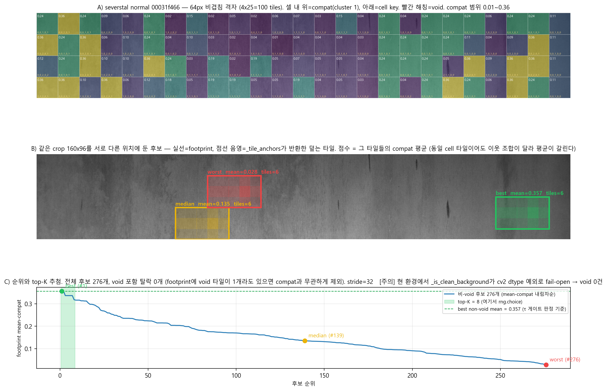

# AROMA 핵심 — 대칭 호환성 모델 `ctx_prior(k, c)` 정리

> **목적**: AROMA의 기여가 집약된 `ctx_prior(k, c) ∝ √(P_def(k, c) · P_clean(c))`가 **무엇을 세어 어떻게 확률이 되는지**를 코드·실측 기준으로 정리한다. 논문 §3.2.2·§3.2.4 서술의 근거 문서이며, 설명 시 이 문서를 중심으로 삼는다.
>
> **작성**: 2026-07-29. 코드 = `scripts/distribution_profiling.py`, `scripts/aroma/generate_defects.py`. 실측 = `D:/project/aroma_dataset/profiling/profiling/<ds>/`(로컬 미러, Colab Drive `sym_final/profiling`과 동일 버전 확인됨).

---

## 0. 한 줄 요약

`ctx_prior(k, c)`는 **결함 형태 군집 `k`**(결함 영역 단위)와 **배경 context cell `c`**(64px 패치 단위)의 **공출현 빈도**를, 두 방향에서 대칭으로 본 기하평균이다. 두 인자 모두 수작업 상수가 아니라 데이터셋 자체 패치 계수에서 나온다.

---

## 1. 먼저 구분해야 하는 라벨 5종

파이프라인에는 결함 쪽 3종·배경 쪽 2종의 라벨이 있고 **어휘가 겹쳐 혼동을 부른다**. `ctx_prior`가 쓰는 것은 굵게 표시한 두 축뿐이다.

### 결함 쪽

| 기호 | 정체 | 단위 | severstal 값 | 소비처 |
|---|---|---|---|---|
| `class_key` / `defect_type` | **GT 결함 클래스**(주석) | (class, 이미지) 쌍 | class1~4 | multi-class YOLO 라벨, `class_floor` |
| **`k` / `cluster_id`** | **GMM/BIC 형태 군집**(비지도) | **결함 영역(bbox)** | 0~4 (K=5) | `morph_prior`, **compat matrix 행** |
| `defect_subtype` | Table 4 규칙 출력 | 결함 영역 | linear_scratch / compact_blob / irregular / general | `quality_score` |

### 배경 쪽

| 기호 | 정체 | 단위 | 개수 | 소비처 |
|---|---|---|---|---|
| **`c` / `cell_key`** | **context feature tertile 코드** | **64px 패치** | 3⁵ = 243 | **compat matrix 열** |
| `background_type` | Table 3 텍스처 범주 | ROI | 5 (smooth/directional/periodic/organic/complex) | `quality_score` |

⚠ **주의 2건**
- `background_type`을 만드는 `BackgroundAnalyzer`는 **현행 파이프라인에서 실행되지 않는다**(호출부 `stage1_roi_extraction.py`가 `colab_execute_new/`에서 미참조, `roi_metadata` 산출물 부재). `roi_selection.py`는 CLI 기본값 `"directional"` 상수를 쓴다.
- cluster 라벨(`_auto_label`)이 `linear_scratch`·`elongated` 등 Table 4 subtype과 **같은 어휘**를 쓴다. 값이 겹쳐 보여도 별개 분류계다.

---

## 2. `k` — 결함 형태 군집

### 2-1. 대상 단위 = 결함 영역(bbox), 64px 패치 아님

`_morph_worker`(`distribution_profiling.py:296-349`):

```python
metrics = char.analyze_defect_region(mask)          # 6종 특징 ← 최대면적 성분 1개
bx, by, bw, bh = cv2.boundingRect(binary)           # bbox ← 전 연결성분
return {"image_id": f"{defect_type}_{image_path.stem}", ..., "defect_bbox": f"{bx},{by},{bw},{bh}"}
```

- **행 1개 = (defect_type, 이미지) 1쌍.** 한 이미지에 두 클래스 결함이 있으면 두 행이 되도록 `image_id`에 defect_type을 접두한다(단 severstal 실측 중복은 0 — §2-5).
- 검산: severstal 3,620행 = class1 477 + class2 111 + class3 2,748 + class4 284.

⚠ **측정 대상 불일치 (load-bearing)**: 형태 특징 **6종 전부**가 `analyze_defect_region`(`utils/defect_characterization.py:45` `region = max(props, key=lambda r: r.area)`)과 그 뒤 regionprops 블록(`:301-309`)을 통해 **최대면적 연결성분 1개**만 기술한다. 반면 `defect_bbox`와 저장되는 마스크 PNG는 **전 성분**을 포함한다(코드 주석 `:313-315`가 의도 명시 — 합성 crop이 결함 전체를 담도록).

⇒ **`k`는 최대 blob의 형태로 결정되지만, 합성 시 붙는 crop은 모든 blob을 담는다.** 다중 성분이 흔한 데이터셋에서 이 괴리가 커진다(§2-5).

### 2-2. data-driven인 지점 — 군집 수까지 데이터가 정한다

| 요소 | 근거 |
|---|---|
| 군집 수 `K` | `_fit_gmm_bic`(`:463-474`)가 `k ∈ [1, n_gmm_max]`를 순회하며 **BIC 최소** 선택 |
| 군집 경계 | `GaussianMixture(n_components=k, random_state=42, n_init=3)`를 표준화 행렬 `X_norm`에 적합(`:905`) |
| 입력 특징 | `MORPH_FEATURES`(`:76-78`) 6종 — linearity, solidity, extent, aspect_ratio, eccentricity, circularity |
| 배정 저장 | `cluster_assignments[image_id] = k` |

**BIC가 실제로 데이터셋별로 다른 K를 고른다** — leather만 3, 나머지 4종은 5:

| 데이터셋 | 결함 수 | **K** | 군집 (k: n, P(k), label) |
|---|---|---|---|
| AITeX | 352 | 5 | 0: 119, .338, linear_scratch / 1: 29, .082, compact_blob / 2: 79, .224, linear_scratch / 3: 43, .122, general / 4: 82, .233, compact_blob |
| Kolektor | 52 | 5 | 0: 5, .096, linear_scratch / 1: 16, .308, linear_scratch / 2: 15, .288, general / 3: 14, .269, linear_scratch / 4: 2, .038, general |
| Severstal | 3,620 | 5 | 0: 522, .144, linear_scratch / 1: 859, .237, **elongated** / 2: 861, .238, linear_scratch / 3: 438, .121, compact_blob / 4: 940, .260, general |
| MTD | 388 | 5 | 0: 127, .327, general / 1: 61, .157, compact_blob / 2: 79, .204, compact_blob / 3: 85, .219, linear_scratch / 4: 36, .093, linear_scratch |
| MVTec Leather | 92 | **3** | 0: 22, .239, compact_blob / 1: 46, .500, **elongated** / 2: 24, .261, compact_blob |

`P(k) = n_k / N`이 §3.2.4 `ROI_score`의 `morph_prior`다.

### 2-3. `k` ≠ GT 결함 클래스 (실측 증거)

비지도 군집이므로 GT 클래스와 정렬되지 않는다. **모든 군집이 복수 클래스를 혼재**한다.

**Severstal** (K=5, GT 4 classes):

| k | class1 | class2 | class3 | class4 | 합 | 혼재 |
|---|---|---|---|---|---|---|
| 0 | 49 | 42 | 425 | 6 | 522 | 4 |
| 1 | 131 | 11 | 665 | 52 | 859 | 4 |
| 2 | 16 | 58 | 787 | 0 | 861 | 3 |
| 3 | 78 | 0 | 284 | 76 | 438 | 3 |
| 4 | 203 | 0 | 587 | 150 | 940 | 3 |

**MVTec Leather** (K=3, GT 5 classes):

| k | color | cut | fold | glue | poke | 혼재 |
|---|---|---|---|---|---|---|
| 0 | 8 | 0 | 3 | 6 | 5 | 4 |
| 1 | 9 | 19 | 14 | 4 | 0 | 4 |
| 2 | 2 | 0 | 0 | 9 | 13 | 3 |

논문 Figure 3.2.2-1 캡션의 *"k is a shape cluster, not the defect class"* 가 이 사실을 가리킨다.

### 2-4. ⚠ 알려진 한계 — 특징 중복, min-max 왜곡, 라벨 부분 사영

세 가지가 겹쳐 있다. 서로 다른 문제이므로 분리해 기록한다.

#### (a) `linearity`·`eccentricity`가 실질 중복

실측(4,504건 전량, 기계 정밀도):

```
linearity    ≡ 1 − AR⁻²          max|err| = 4.4e-15
eccentricity ≡ √linearity        max|err| = 3.4e-15
Spearman(linearity, AR) = 1.000  (5종 전부)
```

세 특징이 같은 2차 중심모멘트에서 나온다. 단 **GMM은 순위가 아니라 선형 관계에 반응**하므로(Gaussian/유클리드 기하) 표준화 후 Pearson으로 봐야 한다:

| 쌍 | severstal | aitex | leather |
|---|---|---|---|
| linearity ~ eccentricity | **+0.992** | **+0.973** | **+0.990** |
| linearity ~ aspect_ratio | +0.563 | +0.516 | +0.799 |
| aspect_ratio ~ eccentricity | +0.518 | +0.455 | +0.744 |

⇒ **`linearity`·`eccentricity`만 2중 가중**이다. `lin = 1 − AR⁻²`가 강한 비선형이라 `aspect_ratio`는 Spearman 1.000에도 선형 중복이 아니다. "3중 가중"은 과장.

#### (b) min-max 표준화가 `aspect_ratio`를 죽인다

표준화가 z-score가 아니라 **min-max**다(`:900-902`):

```python
X_norm = (X - X.min(0)) / (X.max(0) - X.min(0) + 1e-6)
```

min-max 후 분산 점유율(= 유클리드 거리 기여):

| 특징 | severstal | aitex | leather |
|---|---|---|---|
| circularity | **31.4%** | 19.4% | 20.4% |
| linearity | 23.0% | 18.3% | 23.0% |
| extent | 18.8% | **22.0%** | 15.9% |
| eccentricity | 13.0% | 9.7% | 18.0% |
| solidity | 10.3% | 16.4% | 11.7% |
| **aspect_ratio** | **3.5%** | 14.3% | 11.0% |

severstal에서 `aspect_ratio`가 **3.5%로 6종 최저**다. Table 4가 유일한 판정 기준으로 쓰는 특징이 군집화에서는 거의 무력하다. 원인은 우편향 + min-max:

| 데이터셋 | AR p50 | p90 | p99 | max | p99/max |
|---|---|---|---|---|---|
| **severstal** | 4.73 | 13.70 | 26.04 | **74.74** | **0.35** |
| aitex | 5.13 | 46.70 | 82.21 | 90.51 | 0.91 |
| mtd | 2.48 | 8.79 | 21.43 | 25.75 | 0.83 |
| leather | 2.45 | 6.05 | 8.63 | 10.35 | 0.83 |
| kolektor | 5.17 | 6.87 | 8.90 | 9.84 | 0.90 |

severstal만 `p99/max = 0.35` — **극단값 1개가 축의 65%를 차지**해 나머지가 하단 1/3에 압축된다. z-score였다면 없을 문제이고, 나머지 4종(0.83~0.91)은 정상이다. **severstal 특유의 이상치 민감성.**

즉 severstal에서 실제 지배 축은 `aspect_ratio`가 아니라 **`circularity`(31.4%)**다.

#### (c) cluster 라벨이 군집의 부분 사영

`_auto_label(centroid)`(`:1405-1418`)은 6종 중 **3종만** 본다:

```python
ar, sol, lin = centroid['aspect_ratio'], centroid['solidity'], centroid['linearity']
if lin > 0.7 and ar > 5.0:   return "linear_scratch"
if ar > 4.0:                 return "elongated"
if ar < 2.0 and sol > 0.85:  return "compact_blob"
if sol < 0.65:               return "irregular"
return "general"
```

`extent`·`eccentricity`·`circularity`는 라벨에 **전혀 들어가지 않고**, `lin`은 `ar`의 함수이므로 실질 독립 축은 `ar`·`sol` **2개**다. ⇒ **6차원으로 군집화하고 2차원으로 이름을 붙인다.**

**AITeX 실례 — `linear_scratch`가 두 번, `compact_blob`이 두 번 나온다:**

| k | n | label | linearity | solidity | extent | aspect_ratio | eccentricity | circularity |
|---|---|---|---|---|---|---|---|---|
| 0 | 119 | linear_scratch | 0.9991 | 0.5642 | 0.3411 | **42.39** | 0.9995 | **0.0509** |
| 1 | 29 | compact_blob | 0.3097 | 0.9361 | 0.8111 | 1.36 | 0.4771 | **1.3113** |
| 2 | 79 | linear_scratch | 0.9678 | 0.6711 | 0.4671 | **8.28** | 0.9836 | **0.2469** |
| 3 | 43 | general | 0.9323 | 0.9700 | 0.9147 | 3.90 | 0.9655 | 0.5014 |
| 4 | 82 | compact_blob | 0.5524 | 0.8884 | 0.7170 | 1.58 | 0.7364 | **0.9622** |

규칙 경로:

```
k=0  ar=42.392 lin=0.999  → 규칙1) lin>0.7 AND ar>5.0   → linear_scratch
k=2  ar= 8.278 lin=0.968  → 규칙1) 동일                  → linear_scratch   ← 중복
k=1  ar= 1.361 sol=0.936  → 규칙3) ar<2.0 AND sol>0.85  → compact_blob
k=4  ar= 1.577 sol=0.888  → 규칙3) 동일                  → compact_blob     ← 중복
```

규칙 1의 `ar > 5.0`에 **상한이 없어** k=0(AR 42.4)과 k=2(AR 8.3)이 함께 통과한다. 두 군집은 실제로 매우 다르다 — AR 5.1배, circularity 4.9배(0.051 vs 0.247). k=0은 극단적으로 길고 얇은 실 형태, k=2는 중간 길이 긁힘이다. **정작 둘을 가장 크게 갈라놓은 `circularity`가 라벨 판정에 안 들어간다.**

⇒ **`k`를 라벨로 지칭하면 안 된다.** AITeX의 "linear_scratch 군집"은 두 개이고 서로 5배 다르다. Figure 3.2.2-1 범례가 `k{n} · label` 형식으로 번호와 라벨을 함께 쓰는 것이 이 점에서 옳다.

별건 TODO: `.claude/.dev_note/aroma_subtype_percentile_thresholds.md` §10.

### 2-5. 데이터셋별 관측 단위 — AITeX vs Severstal 대조

`k`의 대상은 "결함 하나"가 아니라 **한 행**이고, 그 행이 무엇을 뜻하는지는 데이터셋마다 다르다.

| | AITeX | Severstal |
|---|---|---|
| 행 1개 | 결함 포함 **타일** 1장 (256×256, single-class) | (class, 이미지) 1쌍 ≈ 이미지 1장 (1600×256) |
| 행 수 | 352 | 3,620 |
| 클래스 축 | single (`defect_type` = `defect` 뿐) | multi (class1~4) |
| 다중 연결성분 비율 | **6.5%** (23/352) | **27.9~73.5%** (class별) |
| 최대 성분 수 | 4 | **17** |
| 이미지당 context 패치 | 16.0 (min 10 / max 16) | **98.4** (min 5 / max 100) |
| `P_def` support (관측 cell) | **22~60** / 243 | **192~197** / 243 |
| K (BIC) | 5 | 5 |

#### ① 다중클래스 라벨이 있으나 실제 이미지 중복은 0

| | 값 |
|---|---|
| (class, image) 쌍 | 477 + 111 + 2,748 + 284 = **3,620** |
| distinct image stem | **3,620** |
| 2개 이상 클래스에 걸친 이미지 | **0 / 3,620 (0.0%)** |

`image_id = f"{defect_type}_{stem}"`는 다중클래스 대비 안전장치이지만 severstal에서 실제로 발동하지 않는다. `prepare_severstal.py`가 각 이미지를 **하나의 클래스에만** 배정했다.

⚠ **그 흔적으로 참조되지 않는 마스크가 남는다** — `masks/class{n}` 파일 수가 `test/class{n}`보다 많다:

| | test/ | masks/ | 차이 |
|---|---|---|---|
| class1 | 477 | 477 | 0 |
| class2 | 111 | 129 | +18 |
| class3 | 2,748 | 2,798 | +50 |
| class4 | 284 | 430 | +146 |
| **합** | 3,620 | 3,834 | **+214** |

`_find_mask_path`(`:164-175`)가 `masks/{defect_type}/{stem}.png`를 **우선** 조회하므로 형태 특징은 항상 해당 클래스 마스크에서 산출된다(merged `masks/{stem}.png`는 폴백, 미사용). 다만 **다른 클래스에 배정된 이미지의 결함 214건은 형태 통계에 진입하지 않는다.**

#### ② 다중 성분이 흔하고, 형태 특징은 그중 하나만 본다

클래스별 표본 측정(연결성분 수 분포):

| class | 표본 | 성분 1개 | **2개 이상** | 최대 |
|---|---|---|---|---|
| class1 | 200 | 95 | **52.5%** | 16 |
| class2 | 129 | 93 | 27.9% | 4 |
| class3 | 200 | 53 | **73.5%** | 17 |
| class4 | 200 | 82 | **59.0%** | 9 |

§2-1의 측정 대상 불일치가 여기서 실질 문제가 된다. class3은 **73.5%**에서 성분이 여러 개인데:

- **`k` 결정** ← 최대면적 blob 1개의 형태 (6종 특징 전부)
- **합성 crop** ← `defect_bbox` = 전 성분을 감싸는 상자 + 전 성분 마스크 PNG

즉 **군집이 기술하는 대상과 실제로 붙여지는 대상이 다르다.** 최대 blob이 길쭉한 스크래치라 `k`가 `linear_scratch` 군집에 들어가도, 붙는 crop은 스트립에 흩어진 17개 덩어리 전체일 수 있다. AITeX(6.5%)에서는 거의 발생하지 않던 문제다.

#### ③ 그래서 `k`의 해석이 달라진다

AITeX `k`는 대체로 **단일 결함의 형태**를 가리킨다. Severstal `k`는 **최대 blob의 형태**를 가리키며, 그 행이 대표하는 실체(=합성될 crop)는 결함 앙상블이다. §2-3 교차표에서 모든 cluster가 3~4개 GT class를 혼재한 것도 이와 무관하지 않다 — 최대 blob 형태는 클래스 정체성보다 약한 신호다.

#### ④ `ctx_prior` 추정 밀도가 두 배 이상 다르다

이미지당 context 패치가 AITeX 16개(256×256 ÷ 64px 격자 = 4×4) vs Severstal 98.4개(1600×256 → 25×4 = 100)다. 그 결과:

- Severstal `P_def(k, ·)`는 cluster당 수만~수십만 패치로 추정되어 **관측 cell이 192~197 / 243**(거의 전 공간)
- AITeX는 **22~60 / 243**으로 훨씬 희소 → `S_k`가 작고, 게이트 질의 시 미관측 cell(neutral 0.5, §6)로 빠질 확률이 크다

**같은 `ctx_prior` 공식이 두 데이터셋에서 표본 밀도가 전혀 다른 추정치를 만든다.** compat 게이트 진단에서 AITeX가 중간 케이스(관측 cell 전멸거부 + neutral fallback 수락)로 분류된 것과 정합한다(`.claude/.dev_note/aroma_compat_gate_clean-grounded_redesign.md`).

---

## 3. `c` — 배경 context cell

### 3-1. 대상 단위 = 64px 패치. 단 `c`는 패치가 아니라 **범주**

```
64px 패치 1개 → 5개 context feature 측정 → 각 tertile bin(0/1/2) → cell 코드 c
```

**다대일**이다. 패치는 세는 단위(관측), cell은 담는 칸(범주).

`distribution_profiling.py`:
- `CONTEXT_FEATURES`(`:80-83`) 순서 = `local_variance, edge_density, texture_entropy, frequency_energy, orientation_consistency`
- `N_CONTEXT_BINS = 3`(`:85`) — 주석 `P33 / P66 → bins 0, 1, 2`
- `_compute_bin_edges`(`:497-515`) → `edges[feat] = [p33, p66]` (데이터셋별 유도)
- `_context_cell_key`(`:480-494`) → `np.searchsorted(edges, val, side="right")` + 상한 clamp
  ⇒ **bin 0 = 하위 tertile, 1 = 중간, 2 = 상위.** 다섯 자리를 `_`로 연결. 공간 = **3⁵ = 243**

예: `c = 0_0_0_1_0` = local_variance 하위 / edge_density 하위 / texture_entropy 하위 / frequency_energy **중간** / orientation_consistency 하위.

### 3-2. 실측 규모 — cell 하나에 수천 패치가 담긴다

| 데이터셋 | context 패치 | 관측 clean cell | cluster별 P_def cell |
|---|---|---|---|
| AITeX | 120,140 | 128 / 243 | 22–60 |
| Kolektor | 52,943 | 242 / 243 | 105–203 |
| Severstal | 936,769 | 208 / 243 | 192–197 |
| MTD | 27,512 | 216 / 243 | 116–187 |
| MVTec Leather | 86,106 | 191 / 243 | 147–180 |

Severstal good 패치 590,200개가 208 cell에 담김 → **평균 약 2,838 patches/cell**. `P_clean(c)`는 특정 패치가 아니라 **히스토그램 한 칸의 높이**다.

---

## 4. 두 확률 — 무엇을 세는가

`_build_symmetric`(`distribution_profiling.py:551-627`). 결함 영역과 겹치는 패치(mask>0.5)는 `_context_worker`가 **상류에서 제외**하므로 계수 대상은 전부 배경이다(docstring `:566-568`).

```python
for r in context_rows:
    if r["image_type"] == "good":
        clean_counts[_context_cell_key(r, bin_edges)] += 1          # :590-592
    elif r["image_type"] == "defect":
        cid = cluster_assignments.get(r["image_id"])                # :594  ← 이미지의 k 상속
        def_counts[int(cid)][_context_cell_key(r, bin_edges)] += 1  # :598

clean_dist   = {cell: cnt / clean_total}                            # :601-604  → P_clean
P_def_patch[k] = {cell: cnt / total_k}                              # :606-612  → P_def
```

$$P_{\text{clean}}(c) = \frac{n_{\text{clean}}(c)}{\sum_{c'} n_{\text{clean}}(c')}, \qquad P_{\text{def}}(k, c) = \frac{n_{\text{def}}(k, c)}{\sum_{c'} n_{\text{def}}(k, c')}$$

| | 모집단 | 정규화 |
|---|---|---|
| `P_clean(c)` | 전 **normal 이미지**의 배경 패치 | 합 = 1 (실측 1.0000) |
| `P_def(k, c)` | 결함 영역이 cluster `k`인 **결함 이미지**의 배경 패치 | cluster별 합 = 1 (실측 1.0000) |

**두 granularity의 접합점이 여기다.** 패치가 개별적으로 `k`로 분류되는 게 아니라 **소속 이미지의 `k`를 물려받는다**. 따라서 `P_def(k, c)`는 "cluster `k` 결함이 **어떤 배경 위에 놓여 있었는가**"의 분포이며, 결함 픽셀의 분포가 아니다.

---

## 5. SGM — 기하평균·support·정규화

`:614-627`:

```python
raw[cell] = ((p_def + epsilon) * (p_clean + epsilon)) ** 0.5   # epsilon = 1e-3
matrix_symmetric[k] = {cell: raw[cell] / max(raw.values())}
```

$$\text{ctx\_prior}(k, c) = \frac{\sqrt{(P_{\text{def}}(k,c)+\varepsilon)(P_{\text{clean}}(c)+\varepsilon)}}{\max_{c' \in S_k} \sqrt{(P_{\text{def}}(k,c')+\varepsilon)(P_{\text{clean}}(c')+\varepsilon)}}$$

| 요소 | 의미 |
|---|---|
| `√( · )` | **기하평균** — 두 인자에 대칭. 어느 한쪽이 0이면 전체 붕괴 |
| `ε = 10⁻³` | additive smoothing — 위 0-붕괴 방지. `symmetric_epsilon`으로 provenance 저장 |
| `S_k = {c : P_def(k,c) > 0}` | **관측 support** — 그 cluster에서 실제 관측된 cell만 대상 |
| `max` 나눗셈 | 행 정규화 → cluster별 최적합 cell = 1.0. 논문 식이 `=`가 아니라 `∝`인 이유 |

**대칭성의 의미**: 결함 쪽엔 흔하지만 clean에는 드문 cell이 그 **반대와 동등하게 감점**된다. 이 점이 결함-조건부 빈도 `P_def` 단독과 다른 지점이다.

### 실측 예시 — Severstal cluster 1

| 항목 | 값 |
|---|---|
| peak cell | `0_0_0_1_0` |
| `P_def(1, c)` | 0.158574 |
| `P_clean(c)` | 0.051667 |
| 정규화 전 SGM | `√((0.158574+1e-3)(0.051667+1e-3))` = 0.091675 |
| 행 정규화 후 | **1.0000** |

---

## 6. 배치 — `ctx_prior`가 실제 좌표로 바뀌는 5단계

`_positive_place`(`generate_defects.py:888-1030`). **판정 단위는 cell이 아니라 crop footprint다.** 같은 cell 위에 놓인 두 후보라도 crop이 함께 덮는 이웃 타일이 달라 점수가 갈린다.



> 생성: `fig_placement_footprint.py` — 운영 함수(`_extract_context_features`/`_context_cell_key`/`_is_clean_background`/`_tile_anchors`)와 상수(`_COMPAT_TILE`/`_POS_STRIDE`/`_POS_TOPK`)를 직접 import(재구현 금지). 대상 = severstal normal `00031f466`, cluster 1, crop 160×96.

### 1단계 — 후보 격자 열거

crop이 완전히 들어가는 모든 좌상단 위치를 `stride = _POS_STRIDE = 32`로 훑는다. 후보 수가 `_POS_MAX_CAND`를 넘으면 stride를 2배씩 늘려 상한 이하로 맞춘다. 우·하단 끝 좌표는 항상 포함시켜 가장자리가 도달 불가능해지지 않게 한다(`_axis`). 예시에서 **후보 276개**.

### 2단계 — 타일별 (compat, void) 캐시

각 64px 앵커에 대해 **한 번만** 계산한다:

```python
cell    = cell_key_fn(ctx_feat_fn(gray), bin_edges)
compat  = float(compat_row.get(cell, 0.5))     # S_k 밖 = 미관측 → neutral 0.5
is_void = not _is_clean_background(gray, ...)
```

cell·void 모두 cluster와 무관하므로 캐시가 성립 → 비용이 O(후보 수)가 아니라 **O(서로 다른 타일 수)**.

**미관측 cell은 거부가 아니라 중립 0.5다.** 게이트를 하드 필터로 오해하면 안 된다.

그림 **패널 A**가 이 단계다 — 100개 타일(4×25) 각각의 compat(위 숫자)과 cell key(아래). 같은 강판 한 장 안에서 compat이 **0.01~0.36**으로 갈리고, cell도 `0_0_1_0_1`·`1_1_1_0_1`·`0_0_2_0_1` 등으로 흩어진다(§3-1의 "이미지 1장이 평균 27 cell 점유"가 눈으로 보이는 지점).

### 3단계 — 후보 점수 = footprint를 덮는 타일들의 compat 평균

```python
for ay in _tile_anchors(y, ch, h_img, _COMPAT_TILE):
    for ax in _tile_anchors(x, cw, w_img, _COMPAT_TILE):
        compat, is_void = _tile(ax, ay)
        vals.append(compat)
        if is_void: has_void = True
mean = sum(vals) / len(vals)
```

`_COMPAT_TILE_AGG = "mean"`이 기본(대안 `'min'`은 상수에만 존재, 미사용).

그림 **패널 B**가 핵심이다. 동일 crop 160×96이 각각 **6개 타일**(x 3 × y 2)을 덮는데, 위치에 따라 평균이:

| 후보 | 위치 | footprint 타일 | mean-compat |
|---|---|---|---|
| best | (1376, 128) | 6 | **0.357** |
| median | (416, 160) | 6 | 0.135 |
| worst | (512, 64) | 6 | **0.028** |

**13배 차이**다. 타일 수가 같아도 어떤 타일 조합을 덮는지가 점수를 정한다.

### 4단계 — void 배제 (하드 필터)

footprint가 void 타일을 **하나라도** 포함하면 후보에서 제외한다. compat이 높아도 탈락이다. 비-void 후보가 0개면 `None`을 반환해 호출부가 **다른 normal로 도망친다**.

⚠ **현 환경에서 이 단계는 무력하다** — §6-1 참조. 예시에서 void 탈락 **0개**.

### 5단계 — top-K 샘플링

```python
nonvoid.sort(key=lambda t: t[0], reverse=True)   # 안정 정렬 → 동점은 스캔 순서 유지
k = max(1, min(_POS_TOPK, len(nonvoid)))         # _POS_TOPK = 8
_chosen_mean, chosen_pos = rng.choice(nonvoid[:k])
best_nonvoid_mean = float(nonvoid[0][0])         # τ 판정은 최선값으로
return chosen_pos, best_nonvoid_mean, len(nonvoid)
```

argmax가 아니라 상위 8개 무작위인 이유는 `n_per_roi` 반복이 하나의 seeded rng를 공유하므로 **배치 다양성**을 얻기 위함이다. 고정 seed면 결정론이 유지된다.

**τ 임계 비교는 `nonvoid[0]`(최선)로, 배치는 top-K 샘플 위치로** 한다 — "좋은 자리가 하나라도 있으면 이 normal을 쓴다, 단 붙이는 자리는 상위 8개 중 추첨". 그림 패널 C의 초록 밴드가 그 8개, 점선이 τ 판정 기준(0.357)이다.

### 정리 — 같은 cell 안에서 자리를 가르는 요인

| 요인 | 작동 |
|---|---|
| **footprint 조합** | crop이 덮는 이웃 타일들의 compat 평균 (동일 cell 타일이어도 이웃이 다름) |
| void 배제 | footprint에 void 1개라도 있으면 탈락 — compat 무관 (**현재 무력**) |
| top-K rng | 상위 8개 동급 후보 중 추첨 → 최종 좌표 |

`ctx_prior`는 **후보 순위를 매기는 재료**이고, 좌표는 `footprint 평균 → void 필터 → top-8 추첨`으로 정해진다. cell 하나만으로는 자리가 정해지지 않는다.

### 6-1. ⚠ void 게이트가 현 환경에서 무력화돼 있다 (실측 2026-07-31)

`_background_quality_score`(`:457-460`)가 입력을 `float32`로 변환한 뒤 `cv2.Laplacian(gray, cv2.CV_64F)`를 호출한다. **OpenCV 4.13.0은 `CV_32F → CV_64F` 조합을 지원하지 않아 예외를 던진다.**

```python
# _is_clean_background :517-521
        gray_f = gray.astype(np.float32)
        return _background_quality_score(gray_f, blur_threshold) >= min_quality
    except Exception:
        return True          # ← 예외를 삼키고 "clean" 반환 (fail-open)
```

임계 비교 **전에** 예외가 나므로 `min_quality` 값과 무관하다. `_positive_place`도 같은 패턴으로 한 번 더 감싼다(`:981-984` → `is_void = False`).

검증: `_is_clean_background(np.zeros((64,64), np.uint8))` → **`True`**. 순수 검은 패치가 clean으로 판정된다. **로컬과 Colab 모두 cv2 4.13.0에서 동일 재현.**

Laplacian 조합별 지원 여부:

| src | dst | 결과 |
|---|---|---|
| uint8 | CV_64F | OK |
| uint8 | CV_32F | OK |
| **float32** | **CV_64F** | **RAISES** |
| float32 | CV_32F | OK |

**영향 범위** — `_is_clean_background`/`_background_quality_score`를 쓰는 모든 게이트:

| 위치 | 게이트 |
|---|---|
| `:431` | `_foreground_mask` void 전경 거부 가드(`_FG_VOID_QUALITY`) |
| `:980` | `_positive_place` void 배제 (본 절 4단계) |
| `:1096` | `_normal_tile_cells` void |
| `:1271` | 타일 창 void 검사 |
| `:1552` | random fallback 위치 게이트 |
| `:2743` | `load_normal_images` pool 게이트(`--reject-clean-bg`) |

실측 void율(5종 good 타일): **전부 0.0%**. 데이터에 void가 없어서가 아니라 검출기가 fail-open이기 때문이다.

**수정 시 임계 재산정이 함께 필요하다.** `ddepth`를 `CV_32F`로 고쳐 되살리면 `min_quality=0.7`에서 void율이 98~100%로 반대 극단이 된다(가중식의 `blur`·`contrast` 항이 산업 표면 64px 타일에서 구조적으로 낮아 quality median 0.43~0.60). **운영 설정은 `min_quality=0.5`** 이며 그 경우:

| 데이터셋 | void@0.7 | void@0.5 |
|---|---|---|
| severstal | 99.8% | **23.4%** |
| kolektor | 100.0% | 78.4% |
| mtd | 98.4% | **22.0%** |
| mvtec_leather | 100.0% | 99.6% |
| aitex_tiled | 98.5% | **11.5%** |

severstal·mtd·aitex는 11~23%로 합리적, leather 99.6%는 포화(가죽 표면 quality median 0.432) — 별건.

과거 devnote에 게이트가 작동한 실측이 있으므로(검은배경 9.1%→6.0%, `aroma_exp4v2_foreground-void-rejection.md`), **cv2 업그레이드 시점 이후 조용히 죽은 것**으로 보인다. 결과 재현성에 직결되므로 별도 dev_note로 분리 처리한다.

---

## 7. 논문 대응 위치

| 문서 위치 | 대응 내용 |
|---|---|
| §3.2.2 | `k`(GMM/BIC 군집), `c`(P33/P66 tertile cell), Figure 3.2.2-1(군집 산점도·`P(k)`), Figure 3.2.2-2(context feature 분포·tertile 경계) |
| §3.2.4 | `ctx_prior` 식·산출 설명, Figure 3.2.4-1(cluster × cell 히트맵), Figure 3.2.5-3(흐름도) |
| §3.2.3 | `defect_subtype`(Table 4/4b), `background_type`(Table 3) — **`ctx_prior`와 무관한 별개 축** |

---

## 8. 서술 시 지켜야 할 정직성

1. **`k`는 GT 클래스가 아니다** — §2-3 교차표(severstal·leather 모두 전 군집이 복수 클래스 혼재).
2. **`c`는 개별 패치가 아니다** — §3-1 다대일, §3-2 평균 ~2,838 patches/cell.
3. **`k`와 `c`는 관측 단위가 다르다** — 결함 영역 vs 64px 패치, 접합은 이미지 수준 상속(§4).
4. **형태 특징은 최대 blob만, 합성 crop은 전 blob** — §2-1·§2-5②. severstal class3은 73.5%가 다중 성분이라 군집이 기술하는 대상과 붙여지는 대상이 어긋난다. "결함 형태로 군집화한다"고만 쓰면 과장이다.
5. **행 1개의 의미가 데이터셋마다 다르다** — §2-5 대조표. AITeX는 타일, severstal은 이미지. "결함 하나당 하나의 k"가 아니다.
6. **`background_type`(Table 3)은 `c`가 아니며 현행 파이프라인에서 산출되지 않는다** — §1 주의.
7. **`ε = 10⁻³`은 하드코딩 상수다** — "no hand-set constants" 서술과 함께 쓸 때 주의. smoothing은 통상 방법론 기본값이고 행 정규화가 뒤따라 순위 영향은 제한적이라는 것이 방어 논거.
8. **`ctx_prior` 추정 밀도가 데이터셋 간 6배 차이** — §2-5④. AITeX `S_k` 22~60 vs severstal 192~197. 같은 공식이지만 통계적 신뢰도가 다르다.
9. **GMM 특징 중복·min-max 왜곡·라벨 부분 사영** — §2-4. 특히 **`k`를 cluster 라벨로 지칭하면 안 된다**(AITeX는 `linear_scratch` 군집이 2개, 서로 AR 5배 차이).
10. **severstal 마스크 214건이 형태 통계에 진입하지 않는다** — §2-5①.
11. **void 게이트가 현 환경에서 무력화돼 있다** — §6-1. cv2 4.13.0 dtype 예외 + fail-open. "clean-bg 게이트 항상 ON" 정책을 인용할 때 반드시 함께 밝혀야 한다.

---

## 9. 관련 문서

- **`fig_placement_footprint.py`** — §6 시각화 생성 스크립트(운영 함수 import). 출력 `fig_placement_footprint_severstal.png`
- **`.claude/.dev_note/aroma_cleanbg_gate_cv2_dtype_failopen.md`** — §6-1 void 게이트 무력화 결함 상세·수정 시 결정 사항
- `.claude/.dev_note/aroma_compat_gate_clean-grounded_redesign.md` — SGM + patch-granularity 재설계(본 모델의 도입 경위), τ 사전스캔
- `.claude/.dev_note/aroma_table3_background_descriptor_definitions.md` — Table 3 지표 정의, `background_type` 미실행 발견
- `.claude/.dev_note/aroma_subtype_percentile_thresholds.md` — Table 4/4b percentile 전환, linearity 중복 증명
- `pivot_local_validation_20260711.md` — E1(clean-bg 매칭 도메인 조건부: aitex만 강함)
- `class_vs_cluster_validation_20260711.md` — cluster vs class 재포지셔닝
- `Article/figure/script/[figure 3.2.5 3] roi_selection_flow.md` — severstal linear-scratch 예시로 본 선택→배치 흐름
