**Context-Aware 데이터 증강 기반**

**산업용 결함 검출 연구**

결함 patch 생성에서 context-aware 배치·합성으로 이어지는

네 편의 연구를 통합한 학위논문

**한국기술교육대학교 컴퓨터공학과**

지 도 교 수 문 일 영

성 명 한 호 준

2 0 2 6

# 국문 초록

제조 현장의 품질보증은 제품 신뢰성 확보와 경제적 손실 방지의 핵심
요소이며, 딥러닝 기반 자동 외관 검사(Automated Visual Inspection, AVI)의
도입으로 검사 효율성과 정확도가 크게 향상되어 왔다. 그러나 실제 산업
환경에서는 결함 발생률 자체가 낮아 결함 샘플이 근본적으로 희소하고,
정상/결함 클래스 간 데이터 불균형이 심각하여 모델이 소수 결함 클래스에
과소적합되는 문제가 반복적으로 발생한다. 본 학위논문은 이러한 데이터
희소성·불균형 문제를 데이터 증강으로 해결하고자 저자가 수행한 4편의 게재
논문을 하나의 연구 궤적으로 통합한다. 각 연구는 \"결함 후보 영역(ROI)을
어떻게 찾고, 무엇을 그 자리에 배치할 것인가\"라는 단일한 문제의식 위에서
이전 단계의 결과물을 이어받아 좁히거나 확장하는 방식으로 발전하였다: (1)
생성모델(GAN/Diffusion) 기반 결함 patch 증강, (2) ControlNet 기반 결함
생성과 배경 밝기 유사도 기반 ROI 탐색·Poisson blending 합성의 결합, (3)
다중 산업 데이터셋에 재설계 없이 일반화되는 데이터 기반 ROI
자동화(AROMA), (4) 이를 강철 표면이라는 특정 도메인에 특화시키고
ControlNet 기반 생성으로 결함 자체까지 새로 합성한 context-aware
프레임워크(CASDA). 제3\~5장은 방법론·실험 결과와 함께 다음 장으로
이어지는 한계를 명시하고 마지막 제6장은 프레임워크 자체의 한계를
제시하여, 네 편의 연구가 우연한 나열이 아니라 하나의 연속된 발전
과정임을 보인다.

**주요어**: 결함 검출, 데이터 증강, 관심 영역(ROI), ControlNet,
Context-Aware Synthesis, 클래스 불균형

# Abstract

Quality assurance in manufacturing is central to product reliability and
cost control, and deep learning--based Automated Visual Inspection (AVI)
has substantially improved inspection efficiency and accuracy. However,
real industrial settings suffer from intrinsic defect rarity and severe
class imbalance, causing detection models to underfit minority defect
classes. This dissertation integrates four published papers authored by
the candidate into a single research trajectory addressing this
data-scarcity problem through defect data augmentation. Each study
builds on the prior one\'s output around a single question --- where to
place a candidate defect region (ROI) and what to place there: (1)
GAN/Diffusion-based defect-patch augmentation, (2) ControlNet-based
defect generation combined with background-brightness-similarity-based
ROI search and Poisson blending, (3) data-driven automation of ROI
compatibility that generalizes across industrial datasets without
per-domain re-engineering (AROMA), and (4) specialization of that
automated framework to the steel-surface domain combined with
ControlNet-based generative synthesis of the defect content itself
(CASDA). Each chapter reports its methodology and results together with
the specific limitation carried forward into the next, showing that the
four studies form one continuous progression rather than an incidental
list.

**Keywords**: Defect Detection, Data Augmentation, Region of Interest
(ROI), ControlNet, Context-Aware Synthesis, Class Imbalance

**목 차**

> *※ 제3\~5장은 개요·방법론·실험 결과·한계 및 다음 단계로의 연결
> 순으로 구성한다. 제6장은 다음 장으로 이어지는 서사가 없어 \"한계 및
> 다음 단계로의 연결\" 대신 \"한계\"로 종결한다. 네 편의 연구가 공통으로
> 기반하는 이론·배경은 제2장 관련 연구에 통합하고, 참고문헌은 장별로
> 수록하지 않고 제8장 References에 통합한다. Future work 챕터는 본 초안
> 범위에서 제외한다.*

# 제1장 서론

## 1.1 연구 배경 및 필요성

품질보증은 장비의 원활한 작동과 제품 신뢰성을 보장하는 핵심 요소이며,
결함을 조기에 발견하지 못하면 장비 수명 저하와 불량 제품 생산으로 이어져
제조 공정 전반의 경제적 손실을 초래한다. 과거에는 작업자의 육안 검사에
의존했으나, 이는 작업자 상태에 따른 판단 편차와 대량 생산 환경에서의
확장성 부족이라는 한계를 지닌다. 이를 극복하기 위해 딥러닝 기반 자동
외관 검사(Automated Visual Inspection, AVI)가 PCB, 철강, 섬유, 세라믹 등
다양한 산업 분야에 빠르게 도입되고 있으며, 결함 검출 시장은 지속적인
성장세를 보이고 있다.

그러나 딥러닝 기반 결함 검출 모델은 대규모·고품질 학습 데이터에 크게
의존한다. 제조 공정 특성상 불량 발생률 자체가 낮아 결함 데이터 수집이
근본적으로 제한적이며, 이로 인해 정상/결함 클래스 간 심각한 불균형이
발생해 모델이 정상 데이터에 과적합되고 소수 결함 클래스를 충분히
일반화하지 못하는 문제가 반복적으로 관측된다. 회전·반전·색상 변형 등
전통적인 기하학적·색상 기반 데이터 증강은 기존 이미지의 단순 변형에
그쳐, 결함의 구조적 특성이나 결함이 놓이는 배경과의 맥락적(contextual)
관계를 반영하지 못한다는 한계가 있다. 결함 데이터의 절대량을 늘리는
것을 넘어, "실제 결함이 발생할 법한 위치에, 실제 결함과 구별되지 않는
형태로" 학습 샘플을 합성하는 정교한 증강 방법론이 요구되는 이유가 여기에
있다.

## 1.2 문제 정의

본 논문이 다루는 문제는 산업 결함 검출을 위한 결함 이미지 증강이며, 이는
다음 두 개의 하위 문제로 분해된다.

-   **P1 (생성 문제, What to place)**: 결함 patch 자체를 어떻게
    생성·증강할 것인가. 실제 결함의 형태적·구조적 특성을 보존하면서도
    학습에 유효한 다양성을 확보해야 하며, 생성 품질이 낮으면 오히려
    검출 모델의 성능을 저해한다.

-   **P2 (배치 문제, Where to place)**: 생성 또는 재사용되는 결함
    patch를 정상 이미지의 어느 위치(ROI, Region of Interest)에 합성할
    것인가. 결함은 배경 표면의 통계적·형태학적 특성과 무관하게 발생하지
    않으므로, 배경과 호환되지 않는 위치에 합성된 결함은 실제 분포에서
    벗어난 학습 신호를 만들어낸다.

기존 연구는 P1(생성모델 기반 결함 합성)에 상대적으로 집중해 왔으며,
P2는 원본 위치 재사용이나 무작위 배치 같은 단순한 정책에 머무르는 경우가
많았다. 또한 P2를 다루는 경우에도 배치 규칙이 특정 도메인에 수작업으로
설계되어, 산업 데이터셋이 바뀔 때마다 규칙을 재설계해야 하는 일반화
한계가 존재한다. 본 논문은 P1과 P2를 명시적으로 분리한 뒤, P2를
데이터로부터 자동 도출하는 방향으로 정교화하고, 최종적으로 P1과 P2를
단일 프레임워크로 재결합하는 궤적을 다룬다.

## 1.3 연구 목표 및 연구 질문

본 논문의 목표는 결함 데이터 희소성·불균형 환경에서 검출 성능을
개선하는 context-aware 데이터 증강 방법론을 확립하고, 그 유효 조건과
한계를 실증적으로 규명하는 것이다. 이를 위해 다음 연구 질문을 설정한다.

1.  **RQ1**: 생성모델(GAN/Diffusion) 기반 결함 patch 증강은 검출 성능과
    일반화 안정성에 어떤 영향을 미치는가? (제3장)

2.  **RQ2**: 결함 주변 배경과의 유사도를 기준으로 배치 위치(ROI)를
    선정하는 것이 원본 위치 재배치 대비 검출 성능을 개선하는가?
    (제4장)

3.  **RQ3**: 수작업 규칙 없이 데이터로부터 자동 도출되는
    defect--background 호환성 기준이 다수의 산업 도메인에 재설계 없이
    일반화될 수 있는가, 그리고 그 효과는 어떤 조건에서 나타나는가?
    (제5장)

4.  **RQ4**: 자동화된 ROI 프레임워크를 특정 도메인에 특화시키고 조건부
    생성모델과 결합하면, 실제 patch 재사용(copy-paste)의 다양성 한계를
    넘어 소수 클래스 검출 성능을 개선할 수 있는가? (제6장)

## 1.4 연구의 발전 서사

본 논문은 위의 문제의식 아래 저자가 수행한 4편의 게재 논문을 하나의 연구
궤적으로 통합한다. 네 편의 연구는 모두 "데이터 증강을 통한 결함 검출
성능 개선"이라는 단일한 문제의식을 공유하며, 1번 논문의 결함 patch
생성(P1)에서 출발해 ROI 후보군을 탐색·평가하고 결함 이미지를
배치·합성하는 방식(P2)을 순차적으로 정교화한 뒤, 마지막 연구에서 두
문제를 단일 프레임워크로 재결합하는 발전 과정을 이룬다(표 1-1).

**표 1-1. 네 편의 게재 논문과 핵심 방식**

  -----------------------------------------------------------------------
  **단계**   **논문**                **핵심 방식**
  ---------- ----------------------- ------------------------------------
  1          객체탐지 모델기반 장비  YOLOv8 기반 객체탐지 + GAN/Diffusion
             결함검출 방법에 대한    생성모델을 이용한 결함 patch 증강
             연구                    (기존 ROI → copy-paste)

  2          결함검출 모델 성능      ControlNet 기반 결함 생성 + 주변부
             개선을 위한 결함데이터  pixel 밝기 유사도 기반 ROI search →
             증강 방법에 대한 연구   Poisson blending 합성

  3          AROMA: Adaptive         다중 도메인의
             ROI-based               defect_type/background_type을 데이터
             Morphology-Aware        기반으로 고려한 ROI search →
             Augmentation            copy-paste

  4          CASDA: Context-Aware    특정 도메인의
             Steel Defect            defect_type/background_type 고려
             Augmentation            prompt 생성 → ControlNet → 신규
                                     이미지 생성 → copy-paste
  -----------------------------------------------------------------------

각 단계는 이전 단계의 한계를 다음 지점에서 극복한다.

-   **1번 논문**: 생성모델(GAN/Diffusion)로 결함 patch 자체를 \>
    증강하지만, 증강된 결함을 원본 이미지의 동일 위치에 그대로 재배치 \>
    --- 배경과의 호환성(어느 위치에 배치할지)은 고려하지 않음

-   **2번 논문**: 1번의 \"위치 무관 재배치\" 한계를 넘어, 결함 주변 \>
    배경과의 통계적 유사도(밝기)를 슬라이딩 윈도우로 탐색해 배치 \>
    위치(ROI) 자체를 선정하고 합성 이질감을 줄임

-   **3번 논문(AROMA)**: 2번 방식의 수작업 규칙 의존성을 데이터 기반 \>
    호환성 게이트로 대체하여, 여러 산업 데이터셋에 재설계 없이 \>
    일반화되는 자동화된 ROI 검출·copy-paste 프레임워크를 확립함

-   **4번 논문(CASDA)**: 자동화된 ROI 검출 방식을 강철 \>
    표면(Severstal)이라는 특정 도메인에 특화시키고, 여기에 ControlNet \>
    기반 생성모델을 결합하여 결함 자체를 새로 합성함으로써, 실제 \>
    patch를 그대로 재사용하는 copy-paste의 다양성 한계를 넘어섬

## 1.5 연구의 기여

본 논문의 학술적 기여는 개별 논문의 성과를 합산한 것이 아니라, 네 편의
연구가 하나의 축을 따라 일관되게 발전했다는 점 자체에 있다. 구체적인
기여는 다음과 같다.

1.  **ROI 문제의 명시적 분리**: \"무엇을 생성할 것인가(결함 patch)\"와
    \> \"어디에 배치할 것인가(ROI)\"라는 두 하위 문제를 분리하여, 1번 \>
    논문의 결함 생성 중심 접근에서 2번 논문의 배치 위치 탐색으로 \>
    문제의식이 확장되는 과정을 보인다.

2.  **수작업 의존성의 데이터 기반 대체**: 2번 논문의 휴리스틱(밝기 \>
    유사도) 기반 ROI 탐색을, AROMA(3번)에서 patch-level 공존 \>
    통계로부터 자동 도출되는 호환성 게이트로 일반화하여, 데이터셋마다 \>
    규칙을 재설계할 필요를 제거하였다.

3.  **일반화에서 특화로의 전환과 생성적 확장**: AROMA가 확보한 다중 \>
    도메인 일반화 프레임워크를 CASDA(4번)에서 강철 표면이라는 단일 \>
    도메인에 특화시키고, 제4장에서 처음 도입한 ControlNet 생성을 \>
    defect_type·background_type 조건 prompt와 3채널 hint image 기반의 \>
    조건부 생성으로 확장·결합하여, AROMA의 실제 patch \>
    재사용(copy-paste) 방식을 넘어 결함 내용 자체를 새로 합성하는 \>
    단계로 발전시켰다.

4.  **일관된 실증 검증**: 각 연구는 산업 결함 데이터셋(PKU-HRI PCB, \>
    KolektorSDD, AITeX, Severstal, MTD, MVTec Leather)에서 \>
    mAP·mIoU·Dice 등 검출·분할 지표와 FID·KID·LPIPS 등 합성 품질 \>
    지표로 데이터 증강의 효과와 한계(성능-일반화 트레이드오프, 배경 \>
    균질성에 따른 효과 소멸, 소수 시드(n=2)로 인한 통계적 유의성 \>
    미확보)를 함께 보고하여, 제안 기법의 적용 조건과 그 실증적 한계를 \>
    함께 규명하였다.

## 1.6 논문의 구성

본 논문의 이후 구성은 다음과 같다. 제2장은 네 편의 연구가 공통으로
기반하는 이론적 배경과 관련 연구(산업용 결함 검출, 데이터 증강, 생성모델
기반 결함 합성, context-aware 합성, copy-paste·ROI 기반 합성, 데이터 기반
파이프라인 적응, 검출 모델과 평가 지표, 벤치마크 데이터셋)를 통합하여
다룬다. 제3장에서 객체탐지 기반 결함검출 연구(YOLOv8 + GAN/Diffusion
증강), 제4장에서 결함데이터 증강 연구(ControlNet + 유효영역 ROI +
Poisson blending), 제5장에서 AROMA(데이터 기반 defect--background 호환성
모델), 제6장에서 CASDA(ControlNet 기반 context-aware 합성 프레임워크)를
순서대로 다룬다. 제3\~5장은 각 장 말미에 다음 장으로 이어지는 한계를
명시하고, 제7장에서는 네 연구의 결과를 종합하여 연구의 의의와 향후 연구
방향을 논의한다. 각 장에서 인용한 참고문헌은 제8장 References에 통합하여
수록한다.

# 제2장 관련 연구

본 장은 제3\~6장의 네 연구가 공통으로 기반하는 이론적 배경과 관련 연구를
통합하여 정리한다. 각 장에서는 해당 연구 고유의 실험 설정과 사용 방식만
서술하고, 기법의 일반 원리와 선행 연구 대비 위치는 본 장을 참조한다.

## 2.1 산업용 결함 검출과 자동 외관 검사

산업용 결함 검출은 전통적으로 지도학습 문제로 정식화되어, 조밀하게
어노테이션된 결함 이미지로 객체탐지·분할 네트워크를 학습시켜 표면 이상을
지역화하는 방식이 주류를 이룬다 \[1,2\]. Stavropoulos 등 \[3\]의 고무
부품 실시간 결함 검출 시스템과 같이 생산 라인에 배치된 시스템들은 이
패러다임의 실용적 성숙도를 보여준다. 그러나 충분한 라벨링된 결함이
확보될 때 강력한 성능을 내는 완전 지도학습 접근은, 결함이 희소하고
라벨링 비용이 큰 실제 제조 환경에서는 대규모 어노테이션 데이터셋에 대한
의존이 비현실적이라는 근본 제약을 갖는다. 이러한 제약에 대응해 정상
이미지만으로 정상성(normality) 모델을 학습하고 추론 시 이탈을 탐지하는
one-class 이상 탐지가 유력한 대안으로 부상했으며, PatchCore \[4\],
EfficientAD \[5\], SimpleNet \[6\], Reverse Distillation \[7\], Deep
One-Class Classification \[8\] 등이 정상 샘플의 특징 분포 모델링으로
높은 탐지 정확도를 달성했다. 그러나 이들 역시 가용한 정상 데이터가
제한되거나 미세하고 구조적으로 다양한 결함을 양성 변이와 구분해야 할 때
성능이 저하되므로, 제한된 결함 데이터 풀을 증강하는 것이 강건한 산업
결함 검출의 중심 과제로 남는다. 나아가 결함 샘플이 생산 현장·설비군에
분산되어 중앙 집적이 어려운 데이터 분권화 문제도 희소성을 가중시키는데,
연합 학습 기반 고장 진단 \[9\]이 모델 측에서 이를 다루는 것과 달리, 본
논문과 같이 로컬 통계만으로 동작하는 데이터 측 증강은 그 방향과 상보적인
위치에 있다.

## 2.2 데이터 증강과 클래스 불균형

정상/결함 클래스 간의 심각한 불균형은 합성곱 신경망의 성능을 체계적으로
저하시키는 요인으로 규명되어 있으며 \[10\], 제조 도메인에서의 클래스
불균형 문제 역시 체계적으로 정리된 바 있다 \[11\]. 전통적 데이터 증강은
기하학적 변환(회전·반전·스케일링)과 광도 변화(밝기·대비·색상 지터)로
학습셋을 확장하지만 \[12,13,14\], 이러한 라벨 보존 연산은 기존 결함의
외양을 재표집할 뿐 실제 산업 이상이 갖는 구조적 가변성을 도입하지
못한다. Cut--paste 계열 전략은 결함 patch를 추출해 정상 이미지에
삽입함으로써 이 공백을 부분적으로 메우며, 자기지도 이상 탐지의
CutPaste \[15\]와 합성 이상 기반의 DRAEM \[16\]이 대표적이다. 그러나
소박한(naive) cut--paste는 삽입된 결함과 주변 배경의 텍스처·조명·기하의
자연스러운 정합을 이루지 못해 시각적으로 개연성이 낮은 합성물을 자주
만들어내므로, 증강의 관건은 단순한 양이 아니라 사실성(realism)으로
이동해 왔다.

## 2.3 생성모델 기반 결함 합성

생성모델은 다양하고 사실적인 결함 이미지를 합성하는 수단으로 활발히
탐구되어 왔다. 적대적 생성 신경망(GAN) \[17\]은 생성자와 판별자의 경쟁
학습으로 데이터 분포를 근사하며, 의료 영상 증강 \[18\]을 비롯해
Defect-GAN \[19\], 결함 인식 개선을 위한 결함 샘플 생성 \[20\], 반도체
웨이퍼 다이싱 결함 증강 \[21\] 등 결함 합성에 적용되어 왔다. 그러나
GAN은 mode collapse와 학습 불안정성으로 생성 결함의 다양성이 제한되고
데이터셋별 상당한 튜닝을 요구한다. 반면 순방향 노이즈 주입과 역방향
복원 과정을 학습하는 denoising diffusion probabilistic model(DDPM)
\[22\]은 표본 다양성과 충실도에서 GAN을 능가하는 것으로 보고되어 \[23\]
이미지 합성의 최신 표준으로 자리잡았고, 잠재공간에서 동작하는 latent
diffusion model \[24\]이 고해상도 합성을 실용화했다. 최근에는 소수
샘플로부터 이상의 외양과 공간적 위치를 분리해 생성하는
AnomalyDiffusion \[25\], 합성 이상 사실성·강도의 제어가 다운스트림
탐지를 직접 개선함을 보인 RealNet \[26\], 마스크 조건 diffusion으로 철강
표면 결함을 생성하는 DefFiller \[27\], few-shot 철강 결함 생성 \[28\],
클래스 불균형 데이터셋을 위한 조건부 diffusion 증강 \[29\] 등이 이
방향을 확장하고 있다. 그럼에도 대부분의 생성 파이프라인은 결함의 외양을
고립적으로 모델링할 뿐, 결함이 개연성 있게 나타나야 할 배경 맥락을
명시적으로 고려하지 않는다는 공통된 공백을 갖는다.

## 2.4 Context-Aware 결함 합성

공간적·맥락적 제약을 결함 생성 과정에 통합하려는 연구가 성장하고 있다.
ControlNet \[30\]은 사전학습된 diffusion 모델의 생성 능력을 유지하면서
마스크·레이아웃 등 조건 입력을 U-Net 중간 레이어에 주입해 생성을
제어하는 대표적 조건부 생성 구조로, 합성 결함이 호스트 이미지의 구조를
따르도록 유도하는 데 사용된다. 다른 갈래는 결함--배경 호환성을
명시적으로 모델링해 대상 영역의 국소 텍스처·의미와 일관된 결함을
선택·생성하는 접근으로, 본 논문 제6장의 CASDA \[31\]가 결함 유형과 배경
표면의 공존 확률을 인코딩한 호환성 매트릭스를 사용하는 대표 사례다.
다만 이러한 호환성 규칙을 도메인별로 수작업 설계하면 대상 도메인에서는
효과적이더라도 새로운 데이터셋마다 상당한 재설계가 필요해 전이성이
제한되는데, 데이터셋 고유 통계로부터 ROI 모델링·배치 정책을 자동
도출하는 문제는 여전히 열린 과제였으며 본 논문 제5장의 AROMA가 이를
직접 다룬다.

## 2.5 Copy--Paste와 ROI 기반 합성

Dwibedi 등 \[32\]이 대중화하고 인스턴스 분할용으로 정제된 \[33\]
copy--paste 증강은 실제 결함 픽셀을 보존하면서 생성모델의 학습 비용과
아티팩트를 회피할 수 있어 여전히 매력적인 baseline이다. 그러나 그
효과는 결함을 \"어디에\" 붙이는가에 크게 좌우된다: 배치 대상
ROI(Region of Interest)의 선택이 합성 데이터의 사실성과 다운스트림
유용성을 강하게 결정한다 \[34\]. 자연 영상 객체탐지에서는 후보 박스
주변의 시각적 맥락을 모델링해 붙여넣기 위치를 선택하는 Dvornik 등
\[34\]과, 확률 맵 기반 외양 일관성 사전으로 어노테이션된 인스턴스를 같은
이미지 안에서 재배치하는 InstaBoost \[35\]가 context-aware 배치를
탐구했다. 그러나 이들은 자연 장면의 어노테이션된 객체 인스턴스를
대상으로 하며, 희소한 교차 이미지 결함 풀에서 추출한 결함을 텍스처 표면
의 정상 배경 이미지에 합성해야 하고 인스턴스별 재배치 사전이 존재하지
않는 산업 결함 설정과는 조건이 다르다. 이 때문에 기존 산업 접근의
다수는 도메인 불문의 무작위·균일 ROI 선택을 채택하지만, 이는 결함과
후보 위치 간의 형태학적·맥락적 호환성을 무시하는 차선책이다. 합성
경계의 이질감을 줄이는 표준 기법으로는 경계 gradient를 보존하며 색상을
재구성하는 Poisson blending \[36\]이 널리 쓰인다.

## 2.6 데이터 기반 파이프라인 적응

개별 증강 연산자를 넘어, 파이프라인 구성 자체를 데이터 특성에 자동
적응시키는 연구가 진행되어 왔다. AutoAugment \[37\]와 RandAugment
\[38\]는 증강 정책을 수작업 설계 대신 데이터로부터 직접 최적화하며,
데이터셋 난이도의 정량 기술자를 활용하는 복잡도 지표 연구 \[39\]는
측정 가능한 데이터셋 통계가 수작업 규칙 없이 학습 파이프라인을 구성하는
유효한 신호가 될 수 있음을 보여준다. 본 논문 제5장의 AROMA는 이 통찰을
결함 합성에 도입하여, 프로파일링 단계에서 결함 형태·배경 맥락 분포를
측정하고 patch-level 공존 통계로부터 호환성 모델을 직접 도출하는
measure-then-derive 메커니즘과, context-aware 배치가 유효한 조건을
특성화하는 복잡도 지수(MCI, CCI)를 제안한다.

## 2.7 결함 검출 모델과 평가 지표

다운스트림 검출기로는 단일 단계 객체탐지의 표준인 YOLO 계열 \[40\]이
실시간 산업 검사에 널리 쓰이며, 2단계 검출기 Faster R-CNN \[41\]과 함께
딥러닝 객체탐지의 일반적 지형은 \[42\]에 정리되어 있다. 픽셀 단위 결함
분할에는 U-Net \[43\] 계열 인코더--디코더 구조에 ResNet·EfficientNet 등
합성곱 백본을 결합하는 구성이 표준적이다. 검출·분할 성능은
mAP(mean Average Precision)·mIoU·Dice 계수로 평가하고, 합성 이미지의
품질은 실제 분포와의 특징 분포 거리인 FID \[44\]와 KID \[45\], 지각적
유사도인 LPIPS \[46\]로 평가한다. 본 논문의 각 장은 이 지표들을 공통
프로토콜로 사용한다.

## 2.8 벤치마크 데이터셋

본 논문의 네 연구는 6개 공개 산업 결함 데이터셋을 사용한다(표 2-1).
PCB_DATASET은 베이징대학교 인간-로봇 상호작용 오픈랩(PKU-HRI)이 공개한
PCB 결함 데이터셋으로, PCB 제조 공정 \[47\]과 수용 기준 \[48\]에 근거한
6개 결함 유형을 포함한다. KolektorSDD \[49\]는 전기 정류기 표면의
그레이스케일 결함 데이터셋, AITeX \[50\]는 직물 표면, Severstal
\[51\]은 철강 표면(Kaggle 경진대회), MTD \[52\]는 자기 타일 표면,
MVTec AD \[53\]의 Leather 카테고리는 가죽 표면 결함을 제공한다.

**표 2-1. 사용 데이터셋 개관**

  --------------------------------------------------------------------------
  **Dataset**     **도메인**     **규모(이미지)** **사용 장**
  --------------- -------------- ---------------- --------------------------
  PCB_DATASET     PCB            693              제3장
  (PKU-HRI)                                       

  KolektorSDD     금속 정류기    399 (결함 52)    제4장, 제5장

  AITeX           섬유           7,169            제5장

  Severstal       철강           5,902            제5장, 제6장

  MTD             자기 타일      956              제5장

  MVTec Leather   가죽           245              제5장
  --------------------------------------------------------------------------

## 2.9 공통 실험 환경

본 논문의 네 연구는 모두 표 2-2의 공통 환경에서 실험을 수행하였다.
GPU는 연구 시점에 따라 NVIDIA Tesla L4(제3\~5장) 또는 T4(제6장,
ControlNet fine-tuning)를 사용하였으며, 그 외 실행 환경과 프레임워크는
동일하다. 각 장에서는 해당 연구 고유의 모델·학습 설정만 서술한다.

**표 2-2. 공통 실험 환경**

  -----------------------------------------------------------------------
  **Item**               **Description**
  ---------------------- ------------------------------------------------
  실행 환경              Google Colab

  운영 체제              Ubuntu 20.04

  GPU                    NVIDIA Tesla L4 (제3\~5장) / T4 (제6장)

  언어                   Python 3.12.8

  딥러닝 프레임워크      PyTorch 2.x (CUDA 11.8)
  -----------------------------------------------------------------------

종합하면, 기존 연구는 결함 patch의 생성(P1)에 비해 배치(P2)를 단순한
정책에 맡겨 왔고, P2를 다루는 context-aware 접근도 수작업 규칙에 의존해
도메인 간 일반화가 제한적이었다. 본 논문은 이 공백 위에서 P1과 P2를
분리·정교화·재결합하는 네 편의 연구를 전개한다.

# 제3장 객체탐지 모델기반 장비 결함검출 방법에 대한 연구

## 3.1 개요

본 장은 PCB(인쇄회로기판) 제조 공정에서 발생하는 6가지 결함(open, short,
mouse bite, spur, pinhole/missing hole, spurious copper)을 YOLOv8 기반
객체탐지 모델로 자동 검출하는 연구 \[54\]를 다룬다. PCB는 전자기기의 핵심
부품으로, 결함이 발생할 경우 성능 저하는 물론 심각한 안전 문제로 이어질
수 있다. 작업자의 육안 검사에 의존하던 기존 방식은 판단 편차와 검사
지연이라는 한계를 지니므로, 본 연구는 베이징대학교 인간-로봇 상호작용
오픈랩(PKU-HRI)이 공개한 PCB_DATASET(총 693장)을 대상으로 YOLOv8 기반
실시간 결함 검출 시스템을 구축한다. 아울러 학습 데이터 부족 문제를 GAN과
Diffusion 두 가지 생성모델 기반 증강으로 보완하고, 두 증강 기법이 검출
성능과 일반화 안정성에 미치는 영향을 비교 분석한다.

## 3.2 방법론

결함 데이터가 부족하면 검출 모델의 성능이 저하되므로, 본 장은
생성모델을 통해 결함 이미지를 증강하여 데이터 부족 문제를 보강한다.
PCB_DATASET은 PCB 제조 공정에서 흔히 발견되는 6가지 결함 유형을
포함한다(그림 3-1).

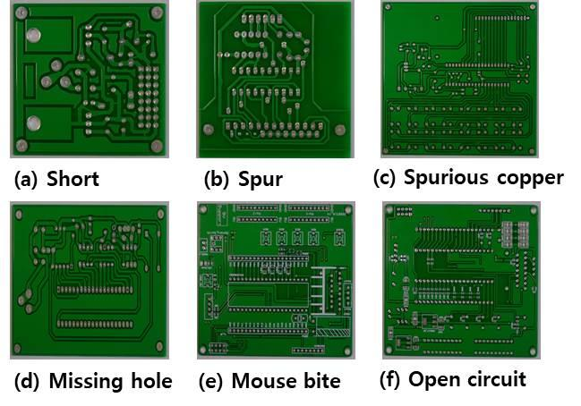

**그림 3-1.** (a) Short, (b) Spur, (c) Spurious copper, (d) Missing hole,
(e) Mouse bite, (f) Open circuit 결함 이미지

그림 3-1의 (a)\~(f)는 각각 short, spur, spurious copper, missing hole,
mouse bite, open circuit에 해당하며, 이후의 생성모델 학습과 증강은 모두
이 여섯 유형을 단위로 수행된다.

이를 위해 먼저 원본 PCB
결함 데이터셋을 이미지별·카테고리별(missing_hole, mouse_bite,
open_circuit, short, spur, spurious_copper)로 분리한다. 동일 이미지 내
동일 카테고리의 결함만으로 생성모델을 학습시킴으로써, 생성모델이 각 결함
유형의 고유한 형태적 특징을 더 명확하게 포착하고 해당 원본 이미지와
유사한 결함을 생성하도록 유도한다. 생성된 이미지는 원본 이미지의 라벨
정보에 맞춰 같은 이미지의 같은 위치에 재배치되며, 이를 통해
이미지·카테고리별 증강 데이터를 얻는다(그림 3-2).

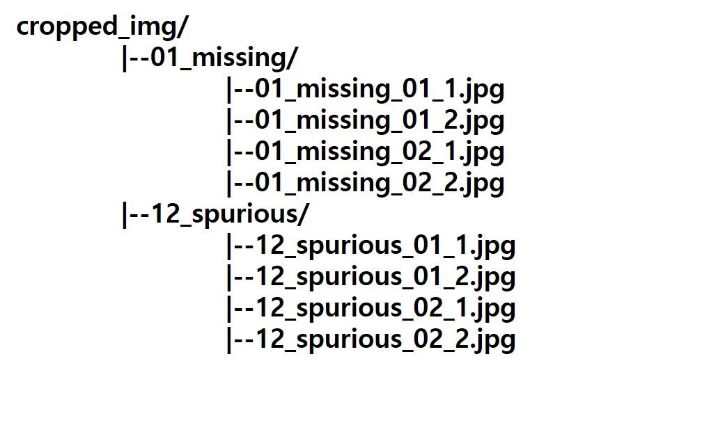

**그림 3-2.** 생성모델 학습을 위한 데이터셋 구조

그림 3-2는 이 분리 구조를 보여준다. 결함 유형별로 경로를 나누어
생성모델을 개별 학습시키고, 생성 결과를 원본 라벨 위치로 되돌려 놓음으로써
증강 이미지가 원본 이미지의 맥락을 유지하도록 한다.

결함 이미지 생성에는 GAN과 Diffusion 두 가지 생성모델을 각각
적용한다(두 모델의 일반 원리는 2.3절 참조).
GAN 기반 증강에서는 생성자(Generator)와 판별자(Discriminator)가
경쟁적으로 학습하는 적대적 과정(그림 3-3)을
통해 기존 데이터셋에 존재하지 않는 결함 이미지를 생성한다(그림 3-4).

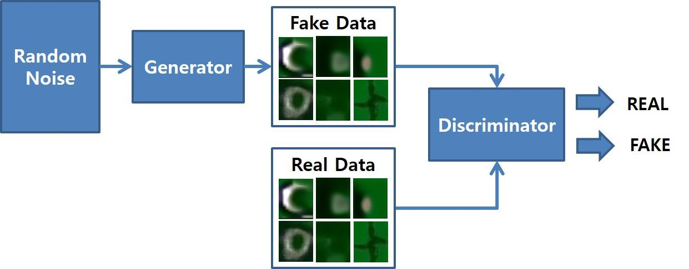

**그림 3-3.** GAN 학습 과정의 흐름도

그림 3-3에서 생성자는 random noise를 입력받아 fake data를 만들고,
판별자는 real data와 fake data를 입력받아 어느 쪽이 실제인지 판별한다.
두 모델이 서로 경쟁하며 학습하는 과정에서 실제 데이터와 구별하기 어려운
결함 이미지가 얻어진다.

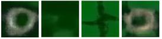

**그림 3-4.** GAN 기반 생성 이미지

그림 3-4는 이렇게 생성된 결함 이미지로, 기존 데이터셋에 존재하지 않는
결함 패턴을 학습 데이터에 추가하는 데 사용된다.

Diffusion 기반 증강에서는 데이터에
점진적으로 노이즈를 더하는 순방향 과정과 이를 역으로 되돌려 이미지를
복원하는 역방향 과정(그림 3-5)을 통해,
결함의 미세한 구조적 특징까지 정교하게 학습·복원한 신규 결함 이미지를
생성한다(그림 3-6).

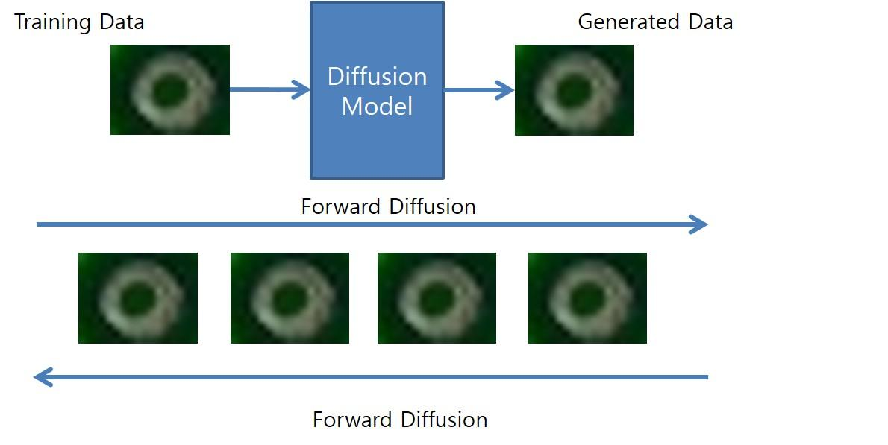

**그림 3-5.** Diffusion 학습 과정의 흐름도

그림 3-5의 Diffusion 모델은 노이즈 추가(Forward Process)와 노이즈
제거(Reverse Process)를 학습하며, GAN 대비 학습이 안정적이고 고품질
이미지를 생성하는 것으로 보고된다.

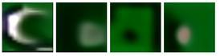

**그림 3-6.** Diffusion 기반 생성 이미지

그림 3-6의 생성 이미지는 GAN 증강 데이터와 동일하게 원본 데이터셋에
포함되어 학습에 활용된다. 두 방식으로
생성된 이미지는 모두 기존 결함 이미지와 함께 YOLOv8 모델의 학습 데이터로
사용된다.

원본 693장에 두 생성모델의 증강 이미지를 더해 최종적으로 972장의
데이터셋을 구성하였으며(표 3-1), 학습·검증 데이터는 90:10
비율(826장/146장)로 무작위 분할하였다. 검증 데이터는 원본 모델과 증강
모델의 공정한 성능 비교를 위해 두 조건에서 동일하게 구성하였다.

**표 3-1. 결함 별 이미지 및 데이터 증강 후 이미지 수량 비교**

  ------------------------------------------------------------------------
  **Defect Type**              **Images**            **Images (증강 후)**
  ---------------------------- --------------------- ---------------------
  Missing_hole                 115                   138

  Mouse_bite                   115                   136

  Open_circuit                 116                   134

  Short                        116                   134

  Spur                         115                   140

  Spurious_copper              116                   144
  ------------------------------------------------------------------------

증강 후에는 학습 데이터의 클래스별 결함 수가 기존 약 470개에서 원본과
증강을 합쳐 대략 600개 수준으로 약 30% 확장되었고, 모든 클래스에서
비교적 균등하게 분포하여 초기 데이터 불균형 문제가 개선되었다(그림 3-7).

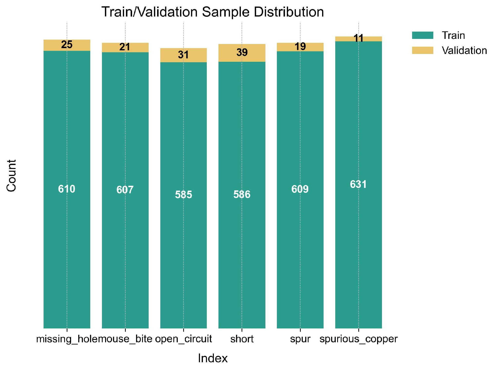

**그림 3-7.** 증강된 PCB 결함 데이터셋의 학습 및 검증 샘플 분포

그림 3-7의 녹색 막대가 학습 데이터에 해당하며, 클래스별 결함 수가
확장되면서 클래스 간 분포가 비교적 균등해졌음을 보여준다. 검증 데이터는
원본 모델과 증강 모델의 공정한 비교를 위해 두 조건에서 동일하게 유지된다.

검출 모델로는 Ultralytics YOLOv8의 두 변형인 YOLOv8s, YOLOv8m을
선정하여, 원본 데이터만 사용한 Basic 조건과 GAN 증강, Diffusion 증강을
적용한 조건을 비교 분석하였다. 실험은 2.9절의 공통 실험 환경에서
수행하였고, 학습은 YOLOv8의 기본 하이퍼파라미터 설정을 그대로
사용하였으며, 세 조건 모두 동일한 학습 설정을 적용해 증강 기법 간 공정한
비교가 되도록 하였다.

## 3.3 실험 결과

모델 성능은 Precision, Recall, mAP50, mAP50-95 네 가지 지표로
평가하였다(표 3-2).

**표 3-2. YOLOv8 모델 성능 평가**

  -------------------------------------------------------------------------------
  **Model**   **Type**    **Precision**   **Recall**   **mAP50**   **mAP50-95**
  ----------- ----------- --------------- ------------ ----------- --------------
  YOLOv8s     Basic       0.94            0.93         0.94        0.49

  YOLOv8s     Gan         0.91            0.90         0.94        0.49

  YOLOv8s     Diffusion   0.97            0.93         0.96        0.51

  YOLOv8m     Basic       0.96            0.96         0.97        0.54

  YOLOv8m     Gan         0.93            0.95         0.96        0.52

  YOLOv8m     Diffusion   0.97            0.93         0.96        0.53
  -------------------------------------------------------------------------------

Basic 조건을 기준으로 비교하면, 더 큰 규모의 YOLOv8m이 YOLOv8s 대비
전반적으로 우수한 성능을 보였다. Basic YOLOv8m은 Precision 0.96, Recall
0.96, mAP50 0.97, mAP50-95 0.54로 모든 지표에서 최고 성능을 기록했으며,
이는 파라미터 수 증가에 따라 복잡한 특징 학습 능력이 향상되어 탐지
정밀도가 높아진 결과로 해석된다(그림 3-8).

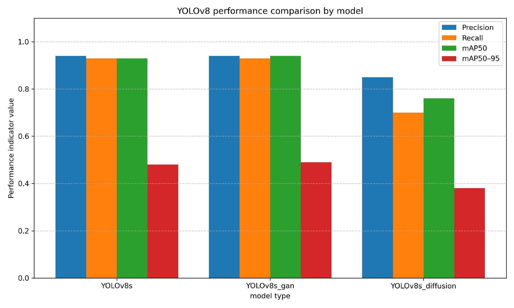

**그림 3-8.** YOLOv8s Basic, Gan, Diffusion 모델 성능 평가

그림 3-8은 YOLOv8s의 세 조건(Basic·GAN·Diffusion)을 지표별로 비교한
것으로, 표 3-2의 수치를 시각적으로 대조할 수 있다.

GAN과 Diffusion 증강 모델을 비교하면, GAN 기반 YOLOv8s·YOLOv8m은 Basic
대비 다소 낮은 Precision(0.91, 0.93)과 Recall(0.90, 0.95)을 보였으나
mAP50은 0.94, 0.96으로 준수한 수준을 유지했다. Diffusion 기반 모델은
YOLOv8s·YOLOv8m 모두에서 mAP50 0.96, mAP50-95 0.51/0.53을 기록하여 GAN
대비 높은 성능을 보였으며, 특히 Diffusion YOLOv8s는 Precision 0.97로
전체 모델 중 가장 높은 정밀도를 달성했다.

다만 검출 지표만으로 결론을 내리기는 이르다. Box Loss 기준 Train/Test
손실 곡선(그림 3-9)을 통해 과적합 정도를
함께 분석하였다(표 3-3, YOLOv8s 기준). Box Loss는 객체 위치 예측의
정확도를 나타내며, 값이 낮을수록 모델이 바운딩 박스를 더 정확하게
예측함을 의미한다. 모든 모델에서 Train Loss는 학습이
진행됨에 따라 꾸준히 하락하는 이상적인 학습 곡선을 보였으나, Test Loss는
전 구간에서 Train Loss보다 높게 유지되며 약 1.5\~2.0 구간에 수렴하여
학습 데이터에 대한 과적합 경향을 공통적으로 나타냈다.

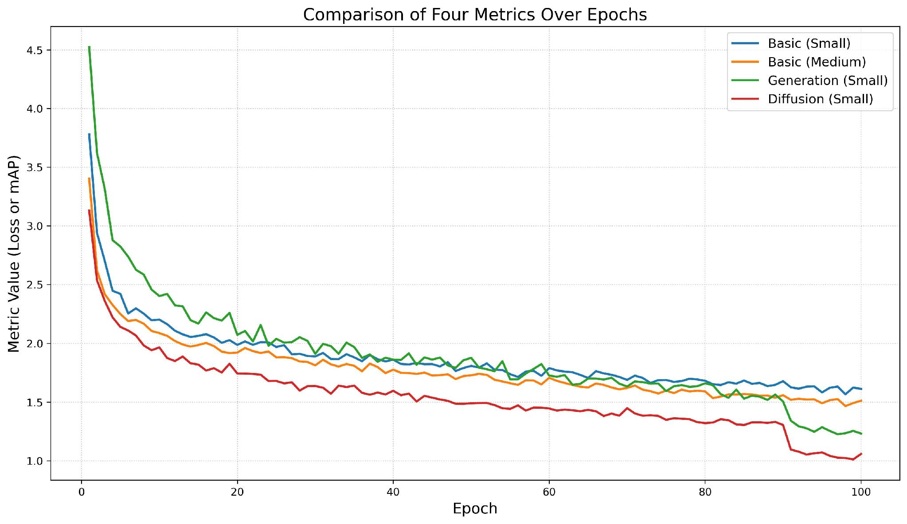

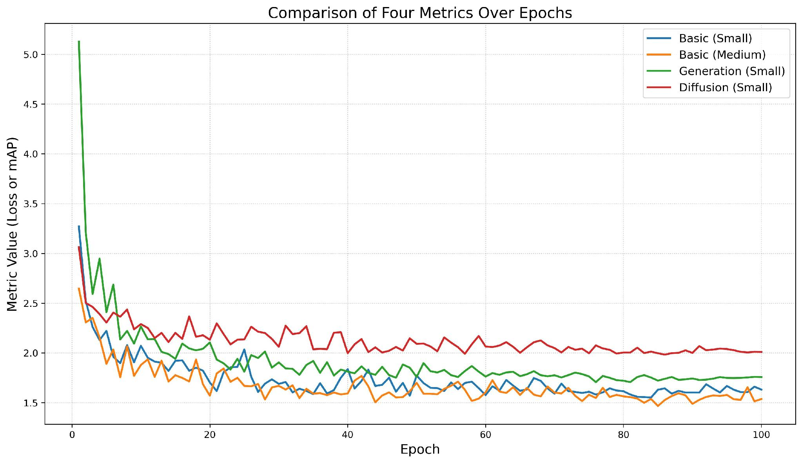

**그림 3-9.** YOLOv8s 모델 Box Loss 학습·검증 곡선 — (a) Train Loss,
(b) Test Loss

**표 3-3. YOLOv8s 모델 성능 및 과적합 분석**

  ------------------------------------------------------------------------
  **Model**       **Train       **Test Loss** **Gap**   **Overfitting**
                  Loss**                                
  --------------- ------------- ------------- --------- ------------------
  Basic_s         1.61          1.63          0.02      최소 과적합

  Diffusion_s     1.17          1.70          0.53      비교적 양호

  Gan_s           1.20          1.72          0.52      비교적 양호
  ------------------------------------------------------------------------

Diffusion_s는 Train Loss 1.17로 가장 낮은 값을 기록해 학습 데이터에
대해서는 가장 좋은 정밀도를 보였지만, Test Loss는 1.70으로 Basic_s보다
높고 Gap도 0.53으로 세 모델 중 가장 커, 일반화 성능이 상대적으로 낮음을
시사한다. Gan_s는 Train Loss 1.20으로 Diffusion_s와 비슷한 수준이고 Test
Loss는 1.72로 오히려 Diffusion_s보다 다소 높으나, Gap은 0.52로
Diffusion_s(0.53)와 유사한 수준의 과적합 양상을 보였다. 두 증강 모델
모두 Basic_s보다는 과적합 경향이 뚜렷하며, 두 방식 간 Gap 차이는 0.01에
불과해 어느 한쪽의 일반화 성능이 명확히 우월하다고 단정하기는 어렵다.

종합하면, 검출 지표(mAP)만 보면 Diffusion 증강이 GAN 증강보다
우수하지만, 과적합 분석까지 함께 고려하면 양상이 달라진다. 세 모델 중
가장 안정적인 일반화 성능을 보인 것은 Gap 0.02의 Basic_s이며, 두 증강
모델의 Gap은 Gan_s 0.52, Diffusion_s 0.53으로 사실상 대등한 수준이다. 즉
성능(mAP)과 일반화 안정성(과적합) 사이에는 트레이드오프가 존재하며, 실제
서비스 환경에 적용할 때는 이 트레이드오프를 감안해 과적합 정도가
근소하게 낮은 GAN 증강 모델이 상대적으로 안정적인 선택지로 고려될 수
있다.

## 3.4 한계 및 다음 단계로의 연결

본 연구는 증강된 결함 이미지를 원본과 \"동일한 위치\"에 그대로
재배치하는 방식을 사용해, 결함이 배치될 배경과의 통계적·형태적 호환성은
고려하지 않는다. 즉 결함 patch 자체의 다양성은 확보했지만 \"어디에
배치할 것인가\"라는 ROI(관심영역) 선정 문제는 다루지 않았다. 이 한계는
제4장(결함데이터 증강 연구)에서 배경 밝기 유사도 기반 ROI 탐색으로 처음
다뤄지기 시작한다.

# 제4장 결함검출 모델 성능 개선을 위한 결함데이터 증강 방법에 대한 연구

## 4.1 개요

본 장은 ControlNet 기반 생성 모델, 유효영역(ROI) 추출, Poisson
blending을 결합한 데이터 증강 기법 \[55\]를 다룬다. 제3장의 PCB 연구가 결함
patch 자체의 생성에 집중하고 배치 위치는 원본과 동일하게 고정했던 것과
달리, 본 장은 \"생성한 결함을 어디에 배치할 것인가\"라는 ROI 선정 문제를
처음으로 다룬다. KolektorSDD 데이터셋(전기 정류기 표면 결함, 총 399장 중
결함 52장)을 대상으로, 결함이 희소한 산업 환경에서 결함 검출 모델의
성능을 개선하는 것이 목표다.

## 4.2 방법론

KolektorSDD \[49\]는 50개의 전기 정류기에서 수집된 399장의 그레이스케일
이미지로 구성된다(표 4-1, 그림 4-1). 모든 이미지는 512×512로 리사이징
후 정규화하여 사용한다.

**표 4-1. KolektorSDD 데이터셋 구성**

  ------------------------------------------------------------------------
  **구분**                 **정상**        **결함**        **전체**
  ------------------------ --------------- --------------- ---------------
  학습(Train)              277             42              319

  검증(Val)                70              10              80

  합계(Total)              347             52              399
  ------------------------------------------------------------------------

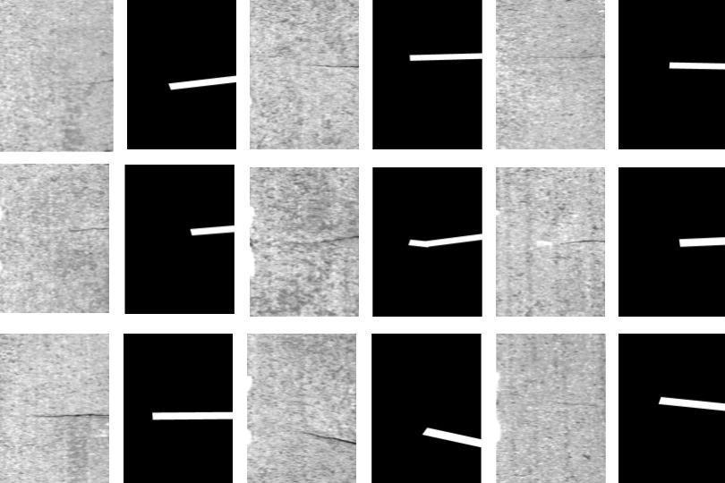

**그림 4-1.** 결함이미지와 마스크이미지

그림 4-1은 KolektorSDD의 결함 이미지와 이에 대응하는 마스크 이미지를
보여준다. 마스크는 결함 영역을 픽셀 단위로 지정하며, 이후 ControlNet의
조건 입력과 ROI 탐색의 기준값으로 사용된다.

학습:검증 분할 비율을 정하기 위해 6:4, 7:3, 8:2 세 시나리오를
비교하였다(표 4-2). 6:4 비율에서는 EfficientNet이 mIoU 0.0071에 그쳐
결함 특징 추출에 사실상 실패하였는데, 이는 소규모 데이터셋에서 결함의
미세한 패턴을 학습하려면 최소한의 임계 데이터량이 필요함을 시사한다.
7:3과 8:2를 비교하면 ResNet34는 유사한 수준의 성능을 유지한 데 비해,
EfficientNet은 8:2에서 mIoU 0.2348, Dice 0.3325로 가장 높은 성능을
기록하며 7:3(mIoU 0.1904) 대비 약 23%의 상대적 개선 폭을 보였다. 이에
따라 본 연구는 8:2 비율(결함 이미지 기준 학습 42장:검증 10장, 약 4:1)을
최종 채택하였다.

**표 4-2. 최적의 데이터 분할 비율 선정 (EfficientNet 기준)**

  -----------------------------------------------------------------------
  **분할비율**                            **mIoU**        **Dice**
  --------------------------------------- --------------- ---------------
  60:40 (Train 239, 결함 31 / Val 160,    0.0071          0.0138
  결함 21)                                                

  70:30 (Train 279, 결함 36 / Val 120,    0.1904          0.2546
  결함 16)                                                

  80:20 (Train 319, 결함 42 / Val 80,     0.2348          0.3325
  결함 10)                                                
  -----------------------------------------------------------------------

결함 패턴 생성 단계에서는 Stable Diffusion v1.5 \[24\] 기반
ControlNet \[30\]을 사용한다(구조 원리는 2.4절 참조). 본 연구에서는
KolektorSDD에서 추출한 결함 마스크가 조건 C가 되고 출력은 생성된 결함
패치 이미지가 된다(그림 4-2). 프롬프트는 \"a surface defect on a metallic
background\"로 고정하며, 학습 환경은 표 4-3과 같다.

**표 4-3. ControlNet 학습 환경**

  -----------------------------------------------------------------------
  **Item**                 **Description**
  ------------------------ ----------------------------------------------
  모델명                   Stable Diffusion v1.5

  Image resolution         512 × 512

  Prompt                   a surface defect on a metallic background

  Optimizer                AdamW

  Noise scheduler          DDPM scheduler

  Mixed precision          FP16

  Batch size               10

  Epochs                   50
  -----------------------------------------------------------------------

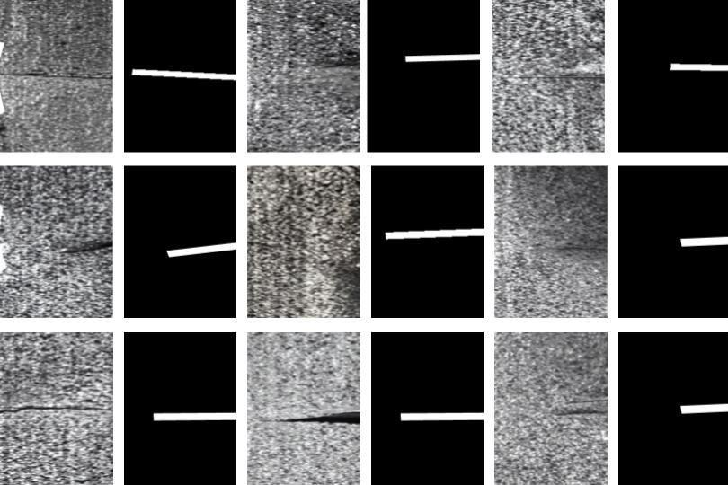

**그림 4-2.** 생성된 결함이미지와 마스크이미지

그림 4-2는 ControlNet이 결함 마스크를 조건으로 생성한 결함 패치와 그
마스크의 예시다. 조건으로 준 마스크의 형태를 따르면서도 원본과 동일하지
않은 결함 패턴이 얻어진다.

다음으로 유효영역(ROI) 추출 단계에서는, 결함 이미지와 마스크로부터 결함
주변 배경 정보를 추출한다. 이때 마스크는 원 모양으로 확장되어 결함이
위치한 표면의 배경 특성을 대표하는 값으로 쓰인다. 정상 이미지에서 이
배경과 밝기가 가장 유사한 영역을 찾기 위해 128×128 크기의 패치를 32픽셀
간격으로 스캔하는 슬라이딩 윈도우 기법을 적용하고, 후보 영역의 평균
밝기와 결함 주변 밝기의 차이를 최소화하는 상위 k개 지점을 후보군으로
지정한 뒤 이 중 하나를 무작위로 선택해 유효 ROI로 정의하고, 선택된
패치의 중심에 생성된 결함을 이식한다(그림 4-3).

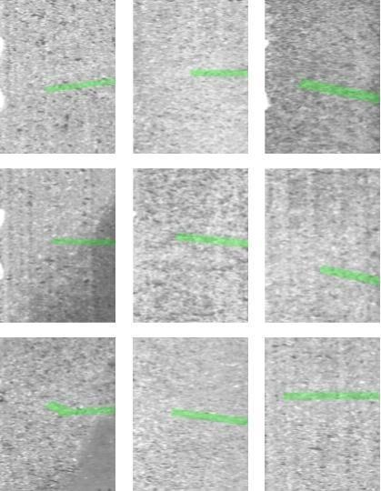

**그림 4-3.** 유효 영역 추출

그림 4-3은 결함 주변 배경 정보를 추출한 뒤 정상 이미지에서 밝기가 가장
유사한 영역을 슬라이딩 윈도우로 탐색해 유효 ROI를 확정하는 흐름을
보여준다. 이 탐색이 합성 시 배경과 결함 사이의 이질감을 줄이는 근거가
된다.

마지막으로 선택된 ROI에 생성 결함 이미지를 삽입할 때는, 단순
copy-paste가 경계면에서 급격한 픽셀 값 변화로 인한 이질감을 유발하는
문제를 막기 위해 Poisson blending \[36\]을 적용한다. 이 기법은 경계의
gradient(변화량)를 유지하면서 ROI 배경 이미지의 경계값에 맞춰 색상을
재구성하여, 생성 결함과 배경 간의 급격한 색상 차이를 방지하고 현실성
있는 합성 이미지를 만든다(그림 4-4).

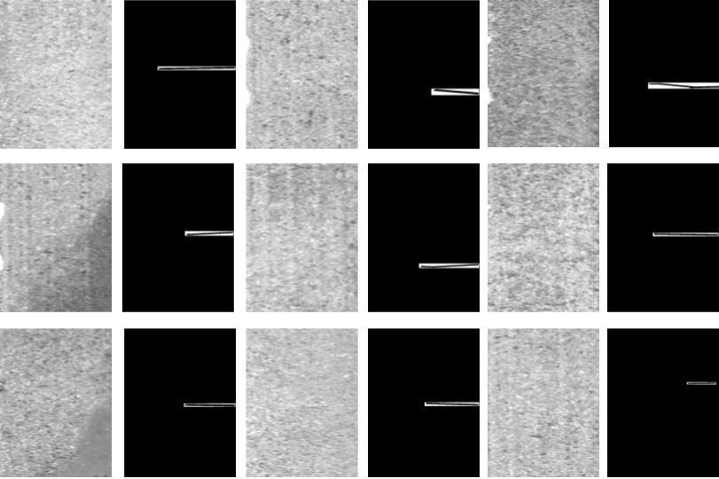

**그림 4-4.** Poisson blending을 이용한 데이터 합성

그림 4-4는 선택된 ROI에 생성 결함을 Poisson blending으로 삽입한
결과로, 단순 copy-paste에서 나타나는 경계면의 급격한 색상 변화 없이
배경과 이어지는 합성 이미지가 얻어진다. 이렇게 합성된 이미지가 본 장의
증강 데이터로 사용된다.

전체 실험은 2.9절의 공통 실험 환경에서 수행하였으며, KolektorSDD
이미지의 결함 영역을 픽셀 단위로 예측하는 모델의 백본으로 합성곱 신경망
기반의 ResNet34와 EfficientNet을 선정해 비교 분석하였다.

## 4.3 실험 결과

제안한 ControlNet 기반 생성 이미지와 유효영역 ROI 합성 기법의 효과를
검증하기 위해, 원본 데이터만 사용한 모델(Real_Only)과 제안된 증강
데이터를 혼합해 학습한 모델(Mixed)의 성능을 mIoU와 Dice
계수(정의는 2.7절 참조)로 비교하였다(표 4-4). 모든 실험은 8:2 데이터
분할 비율에서 수행하였다.

**표 4-4. 원본셋 모델과 증강셋 모델의 성능 비교**

  ---------------------------------------------------------------------------
  **증강 비율** **ResNet34    **ResNet34    **EfficientNet   **EfficientNet
                mIoU**        Dice**        mIoU**           Dice**
  ------------- ------------- ------------- ---------------- ----------------
  Real (원본만) 0.5667        0.6766        0.1682           0.2531

  0.3           0.8069        0.8799        0.5378           0.6070

  0.5           0.8919        0.9400        0.5347           0.5862

  0.7           0.8071        0.8813        0.6860           0.7770
  ---------------------------------------------------------------------------

모든 모델에서 증강 데이터를 혼합했을 때 원본셋 모델 대비 성능이
비약적으로 상승하였다. 특히 ResNet34는 mIoU가 0.5667에서 0.8919로 약
57.4% 향상되어, 제안된 ROI 방식이 실제 결함의 특성을 상당히 정확하게
묘사하고 있음을 보여준다. ResNet34는 증강 비율 0.5에서 mIoU 0.8919로
최적 성능을 기록했으나, 비율이 0.7로 높아지면 0.8071로 오히려 소폭
하락하였다(그림 4-5).
이는 증강 데이터의 다양성이 일정 수준을 넘어서면 실제 데이터의 고유한
분포를 왜곡할 수 있음을 시사하며, 0.5 비율이 학습 안정성에 가장 기여함을
확인하였다.

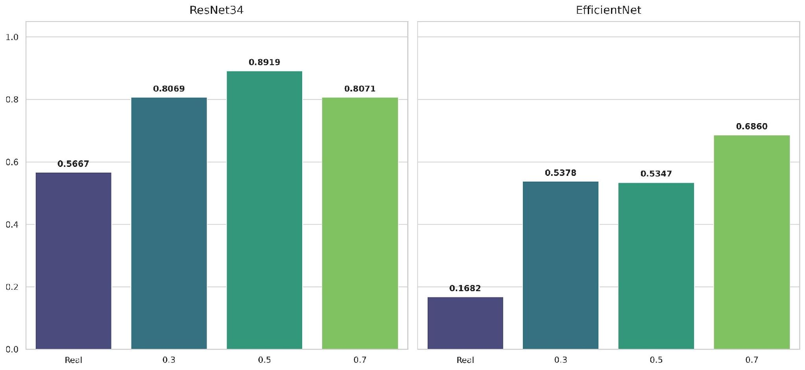

**그림 4-5.** 원본셋 모델과 증강셋 모델의 mIoU 성능비교

그림 4-5에서 ResNet34 계열이 EfficientNet보다 전반적으로 높은 mIoU를
기록하며, ResNet34 0.5 모델이 0.8919로 최고점을 찍은 뒤 0.7에서
하락하는 반면 EfficientNet은 0.7에서 0.6860으로 최고치를 기록해 증강
비중이 커질수록 개선되는 반대 양상을 보인다. 두 모델 모두 증강셋 적용
시 mIoU가 개선된다는 점은 공통적이다.

반면 EfficientNet은 0.3(0.5378)과 0.5(0.5347) 구간에서 정체한 뒤 0.7에서
mIoU 0.6860으로 최고치를 기록하여, 증강 비율이 높아질수록 성능이
개선되는 전반적 경향을 보였다. 이는 ResNet34가 적은 증강 데이터에서도
빠르게 높은 성능에 도달하는 적응력을 지닌 반면, 경량 모델인
EfficientNet은 더 많은 합성 데이터를 통한 반복 학습이 성능 향상에
유효함을 의미한다. Dice 지표(그림 4-6)에서도 유사한 경향이 관찰되어,
ResNet34 0.5 모델이
0.94에 근접하는 수치로 가장 우수한 성능을 보였고, EfficientNet은 Real
조건의 0.2531에서 0.7 비율의 0.777까지 약 3배 가까이 향상되었다. 다만
ResNet34는 증강셋 학습 전 구간에서 Dice 0.87 이상을 유지하며 안정적인
성능을 보인 반면, EfficientNet은 증강 비율에 따른 변동 폭이 상대적으로
컸다. 종합하면, 제안된 데이터 증강 기법은 두 모델 모두에서 데이터 불균형
문제를 성공적으로 개선하였다.

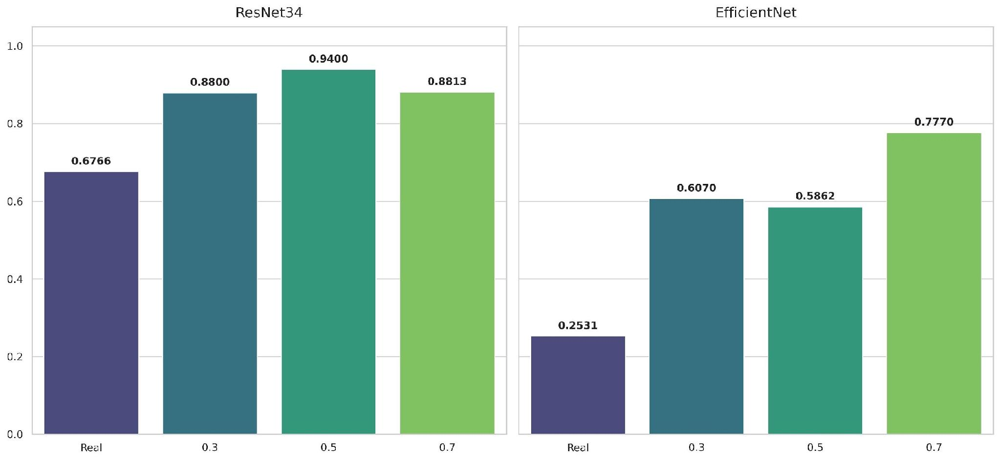

**그림 4-6.** 원본셋 모델과 증강셋 모델의 Dice 성능비교

## 4.4 한계 및 다음 단계로의 연결

ROI 추출이 결함 주변 픽셀의 평균 밝기 기반으로만 이뤄져, 실제 산업
이미지의 복잡한 배경 텍스처·결함의 구조적 특성을 충분히 반영하지 못하는
한계가 있다. 이 한계는 제5장(AROMA)에서 배경의 형태학적·통계적 특성을
다차원으로 프로파일링하고 이를 여러 산업 데이터셋에 재설계 없이 적용하는
범용 프레임워크로 확장되며, 배경·결함 특성을 생성 모델의 프롬프트에까지
반영하는 방향은 제6장(CASDA)에서 다룬다.

# 제5장 AROMA: Adaptive ROI-based Morphology-Aware Augmentation

## 5.1 개요

AROMA \[56\]는 제4장에서 다룬 배경 유사도 기반 ROI 탐색을, 수작업 규칙
없이 데이터로부터 자동으로 도출하는 방향으로 확장한 프레임워크다. 제4장의 ROI
탐색이 결함 주변 밝기라는 단일 통계량과 휴리스틱 슬라이딩 윈도우 탐색에
의존했던 것과 달리, AROMA는 defect--background 호환성을 patch-level 공존
통계로부터 직접 산출하는 대칭 호환성 게이트를 제안하여, 산업 현장마다
새로 설계해야 했던 수작업 규칙 의존성을 제거한다. 이를 5개 산업
데이터셋(AITeX-섬유, Kolektor-금속, Severstal-철강, MTD-자기타일, MVTec
Leather-가죽)에 재설계 없이 적용 가능함을 검증함으로써, ROI 프레임워크가
특정 산업에 국한되지 않고 일반화됨을 보인다. 단, 여기서 일반화되는 것은
도메인별 재설계 없이 파이프라인이 동작한다는 방법론적 일반성이며,
다운스트림 검출 성능의 이득은 보편적이지 않다. 5.3절에서 보듯 이득은
baseline 개선 여지와 배경 맥락 복잡도(CCI)가 함께 충족되는 데이터셋에
한정되고, 어느 한 조건이 결여되면 무작위 배치와 수렴하거나 역전된다.

## 5.2 방법론

AROMA 파이프라인은 데이터셋 프로파일링·복잡도 분석에서 시작해 결함
합성과 품질 관리로 이어진다(그림 5-1). 먼저
데이터셋 복잡도 분석 단계에서, 결함 형태의 구조적 다양성을 나타내는
MCI(Morphology Complexity Index, 강도 변화·분포 다양성·결함유형
다양성·클러스터 분리도 4개 정규화 통계의 평균)와, 배경 이질성을 나타내는
CCI(Context Complexity Index, 텍스처 엔트로피·주파수 복잡도·방향성
분산의 평균)를 각 데이터셋의 2만 개 샘플 패치로부터 산출한다.

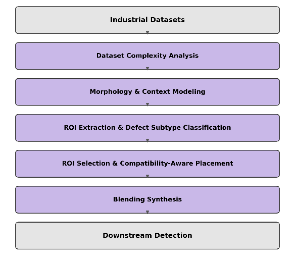

**그림 5-1.** AROMA 파이프라인

### 5.2.1 복잡도 지표 (CCI): 배경 텍스처 분류 수식

배경 텍스처 분류는 백분위수 기반 자동 적응 임계값을 사용:

$$\text{Smooth} = \text{LocalVariance} \leq P_{25}$$

$$\text{Directional} = \left( \text{OrientEntropy} \leq P_{25} \right) \land \left( \text{FreqComplexity} \leq P_{25} \right)$$

$$\text{Periodic} = \text{FreqComplexity} \geq P_{75}$$

$$\text{Organic} = \left( \text{TextureEntropy} \geq P_{50} \right) \land \left( \text{LocalVariance} \geq P_{75} \right)$$

여기서 $P_{k}$는 각 데이터셋에서 자동 계산된 백분위수이므로, 동일한
알고리즘이 모든 데이터셋에 자동 적응한다.

### 5.2.2 복잡도 지표 (MCI): 결함 형태 분류 수식

결함 클러스터 개수는 BIC(Bayesian Information Criterion)로 자동 최적화:

$$K^{*} = \arg\max_{k}\text{BIC}(k)$$

클러스터 개수 $K^{*}$는 데이터셋마다 자동으로 결정되므로 수동 임계값
설정이 불필요하다.

**표 5-1. 데이터셋별 MCI·CCI 통계**

  ------------------------------------------------------------------------
  **Dataset**           **Domain**               **MCI**      **CCI**
  --------------------- ------------------------ ------------ ------------
  AITeX                 Textile                  0.392        0.440

  Kolektor              Metal commutator         0.328        0.224

  Severstal             Steel                    0.455        0.306

  MTD                   Magnetic tile            0.561        0.246

  MVTec Leather         Leather                  0.595        0.200
  ------------------------------------------------------------------------

다섯 데이터셋은 MCI 0.33\~0.60, CCI 0.20\~0.44의 넓은 복잡도 범위에 걸쳐
있어 서로 다른 난이도 영역에 위치하며(그림 5-2), 특히 CCI 축은 이후 5.3절에서 context-aware 배치의
효과를 조건화하는 핵심 지표로 쓰인다. CCI를 4개 구성요소로 분해하면
방향성 분산과 주파수 복잡도가 데이터셋을 가장 크게 구분하며,
방향성·주기성 텍스처를 가진 AITeX가 각각 1.3085, 0.0158로 최댓값을,
매끄럽고 균일한 Kolektor(0.0035, 0.0002)와 MVTec Leather(0.0005,
0.0002)가 최저 수준의 값을 보인다. 반면 텍스처 엔트로피는 2.58\~3.22
범위로 변동이 작아, 배경 구분을 지배하는 것은 밝기 기반 특성이 아니라
구조적 특성임을 알 수 있다. 이 측정치가 다음의 표 5-2 배경 텍스처 범주
구분의 정량적 근거가 된다.

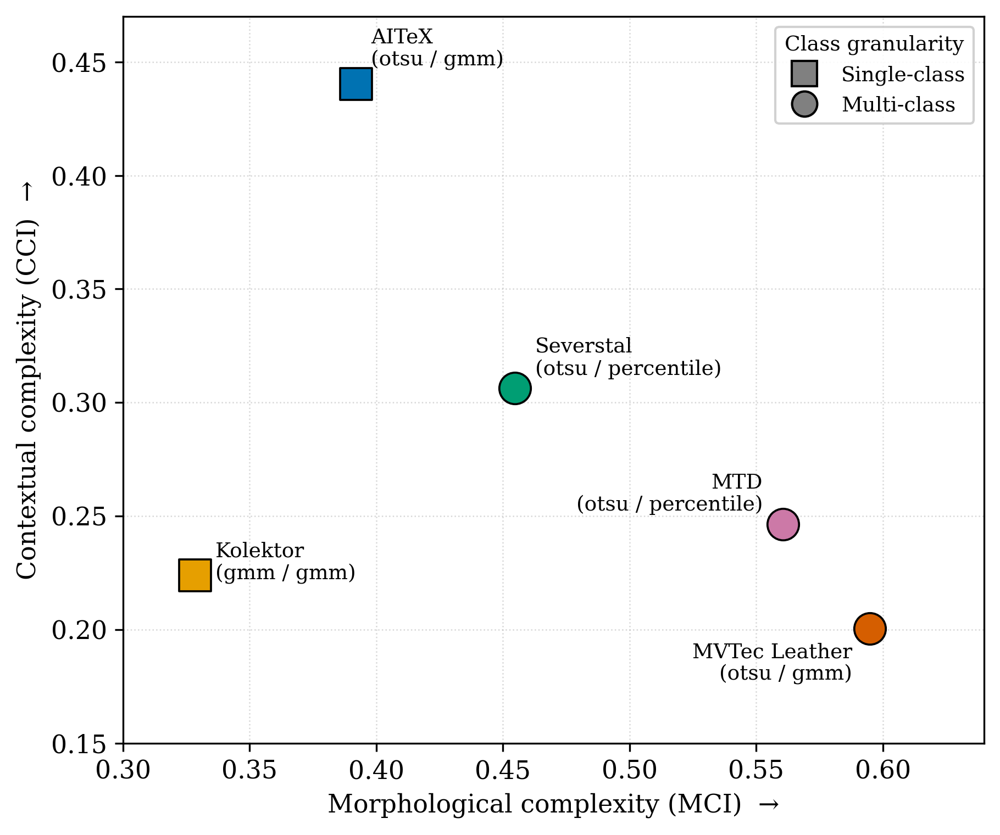

**그림 5-2.** 데이터셋 복잡도 지형(MCI vs. CCI)

그림 5-2는 다섯 데이터셋이 MCI--CCI 평면에서 서로 다른 좌표를
차지함을 보여준다. 이 배치가 5.3절에서 context-aware 배치의 효과가
나타나는 조건을 해석하는 좌표계가 된다.

결함 형태는 Gaussian Mixture(클러스터 수는 데이터셋별 BIC로 결정)로
군집화한다. 결함 형태는 대체로 조밀하고 등방에 가까운 형태에서 가늘고
거의 선형인 긁힘까지 이어지는 신장도(elongation) 연속체를 따라 분포하며,
형태 클러스터는 이 연속체의 구간에 해당한다(그림 5-3). 배경 맥락은 프로파일된
특성의 tertile(P33/P66) 구간화로 이산화하며, 데이터셋마다 이 tertile
경계값 자체가 서로 다르게 나타나 동일한 구간화 절차로도 데이터셋별로
다른 맥락 셀이 만들어진다(그림 5-4). 두 파티션 모두 데이터셋 자체 통계로부터 산출되므로
데이터셋별 상수 설정을 배제한다. ROI는 정상 이미지에서 Otsu 임계화로
전경 마스크를 얻고 연결요소 분석으로 후보를 추출한 뒤, 표 5-2의 기준에
따라 배경 텍스처를 5개 범주로 분류한다.

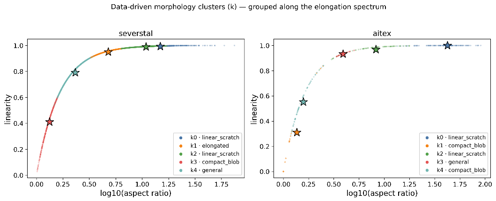

**그림 5-3.** Severstal·AITeX의 데이터 기반 형태 클러스터

그림 5-3의 별표는 각 형태 클러스터의 중심을 나타내며 클러스터 색과
일치한다.

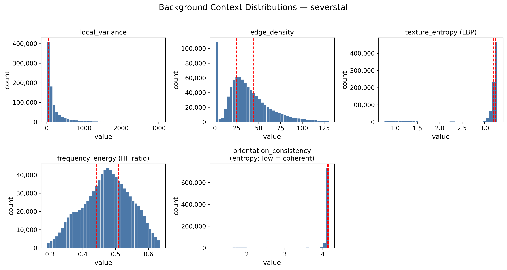

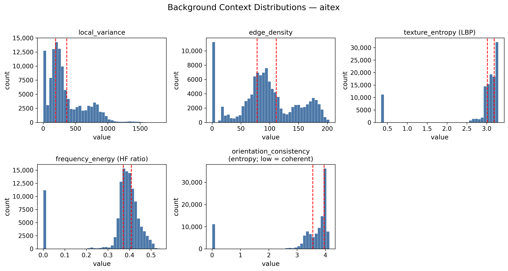

**그림 5-4.** 배경 맥락 특성 분포와 tertile 경계 — (a) Severstal, (b) AITeX

그림 5-4는 프로파일된 다섯 개 배경 맥락 특성과 그 P33/P66 tertile
경계를 보여준다. 동일한 구간화 절차를 적용해도 경계값 자체가
데이터셋마다 달라지므로 생성되는 맥락 셀도 서로 달라진다.

**표 5-2. ROI 배경 텍스처 분류 기준**

  ------------------------------------------------------------------------
  **Category**   **Computational Criteria**          **Example Surface**
  -------------- ----------------------------------- ---------------------
  Smooth         LocalVariance ≤ P25                 bare metal, uniform
                                                     coating

  Directional    OrientationEntropy ≤ P25 AND        textile weave
                 FreqComplexity ≤ P25                

  Periodic       FreqComplexity ≥ P75                tiles, checker
                                                     patterns

  Organic        TextureEntropy ≥ P50 AND            leather, wood, fabric
                 LocalVariance ≥ P75                 

  Complex        else                                boundaries, composite
                                                     surfaces
  ------------------------------------------------------------------------

결함 시드는 SAM(Segment Anything Model) \[57\](Otsu를 fallback으로 사용)으로
마스크를 추출한 뒤, 표 5-3의 기준(linearity, aspect ratio, solidity)에
따라 5개 형태학적 하위유형으로 분류한다. 이 하위유형 라벨은 호환성
게이트의 행 인덱스로 쓰이는 형태 클러스터 k(앞서의 Gaussian Mixture
군집)와는 별개로, 합성 직전 적용되는 하위유형별 탄성 변형(elastic
warping) 변종을 파라미터화하여 도메인 특화 결함 범주에 의존하지 않고
결함 형태에 변이를 부여하는 데 사용된다. 각 데이터셋의 결함 형태
특성(linearity, solidity, extent, aspect ratio, eccentricity,
circularity) 분포를 확인한 결과, 표 5-3의 분류 경계값은 밀집된 데이터
분포 영역을 가로지르지 않고 그 사이에 위치하며, 데이터셋마다 서로 다른
형태학적 영역을 차지하는 것으로 나타났다(그림 5-5는 Severstal·AITeX
사례).

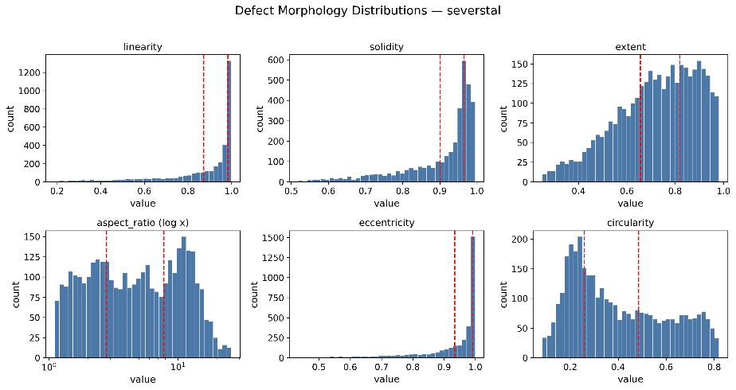

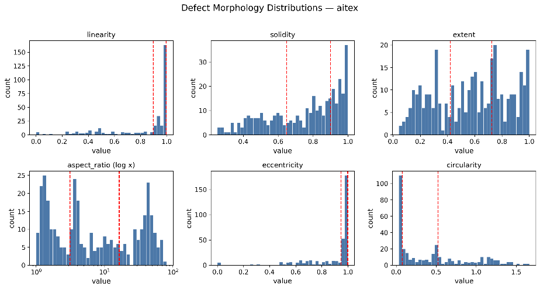

**그림 5-5.** 결함 형태 특성 분포와 표 5-3 경계값 — (a) Severstal, (b) AITeX

그림 5-5의 붉은 점선은 기준을 갖는 두 특성 위에 표시한 표 5-3의
하위유형 임계값이며, aspect ratio는 로그 축으로 표시하였다.

**표 5-3. 결함 하위유형 분류 기준**

  -----------------------------------------------------------------------
  **Subtype**      **Classification Criteria (위에서   **Description**
                   아래로 순차 평가, 최초 일치 채택)** 
  ---------------- ----------------------------------- ------------------
  linear_scratch   Linearity \> 0.9 AND AspectRatio \> 길고 얇은 선형
                   5                                   결함

  elongated        Linearity \> 0.7 AND AspectRatio ∈  신장되었으나 덜
                   \[2, 5\] AND Solidity \< 0.85       선형적인 결함

  compact_blob     Linearity \< 0.6 AND Solidity \>    조밀하고 등방에
                   0.85 AND AspectRatio \< 2           가까운 결함

  irregular        Linearity ∈ \[0.4, 0.8\] AND        불규칙, 중간
                   Solidity ∈ \[0.65, 0.95\] AND       선형도 결함
                   AspectRatio \< 4                    

  general          위 조건 미해당 시 기본값            모호하거나 혼합
                                                       형태의 결함
  -----------------------------------------------------------------------

배치 단계에서는 후보 defect--context 쌍을 ROI_score = ctx_prior +
morph_prior의 무가중 합으로 순위화하여 상위 K개를 채택하되, 형태 클러스터별 기본
쿼터와 다중 클래스 데이터셋의 클래스별 하한선으로 특정 클러스터·클래스가
배제되지 않도록 보장한다. 여기서 ctx_prior는 결함 형태 클러스터 k와
64픽셀 배경 셀 c 사이의 호환성을 ctx_prior(k,c) ∝
√(P_def(k,c)·P_clean(c))로 계산하는 대칭 호환성 게이트이며(그림 5-6), 여기서 P_def(k,c)는 형태
클러스터 k에 속한 결함들의 주변 배경 패치 중 셀 c가 차지하는 확률이고,
P_clean(c)는 전체 정상 배경 패치에서 셀 c가 차지하는 확률이다. 두 항에는
가산 스무딩(ε = 10⁻³)을 적용하고 각 클러스터의 점수는 가장 호환적인 셀이
1이 되도록 행 단위로 재척도화한다. 기하평균은 두 확률이 모두 높은
지점에서만 큰 값을 가지므로 결함 측과 배경 측을 대칭적으로 가중하며, 두
확률 모두 프로파일링 통계에서 직접 도출되므로 수작업 매트릭스 없이 배치
위치가 결정된다. Severstal의 linear-scratch 결함 사례로 전체 흐름을
추적하면, 결함의 형태 클러스터와 후보 배경의 맥락 셀이 각각
morph_prior와 ctx_prior를 산출하고, 이 둘의 합이 후보를 순위화한 뒤
대칭 호환성 게이트가 픽셀 단위 ROI를 최종 확정한다(그림 5-7). 합성 전에는 블러·대비·밝기·노이즈 4개
항목의 가중합(quality = 0.30·blur + 0.30·contrast + 0.20·brightness +
0.20·noise)이 0.7 이상인 배경 패치만 채택하는 품질 게이트를 적용한다.

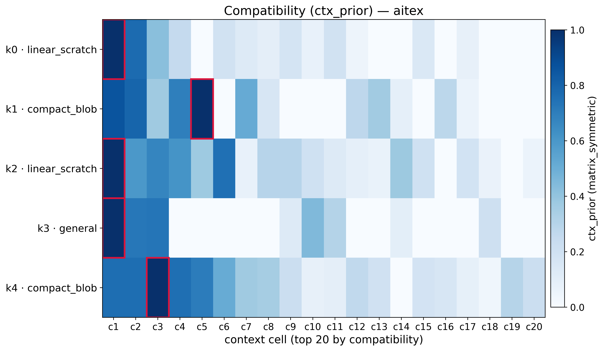

**그림 5-6.** 데이터셋별 대칭 호환성(ctx_prior) 히트맵

그림 5-6은 형태 클러스터 × 맥락 셀 히트맵으로, 각 행에서 붉은 상자가
그 형태 클러스터와 가장 호환적인 맥락 셀을 표시한다. 이질적인
표면(AITeX)에서는 클러스터마다 선호 셀이 갈리는 반면, 거의 균일한
표면(MVTec Leather)에서는 클러스터들이 하나의 지배적인 셀을 공유한다.

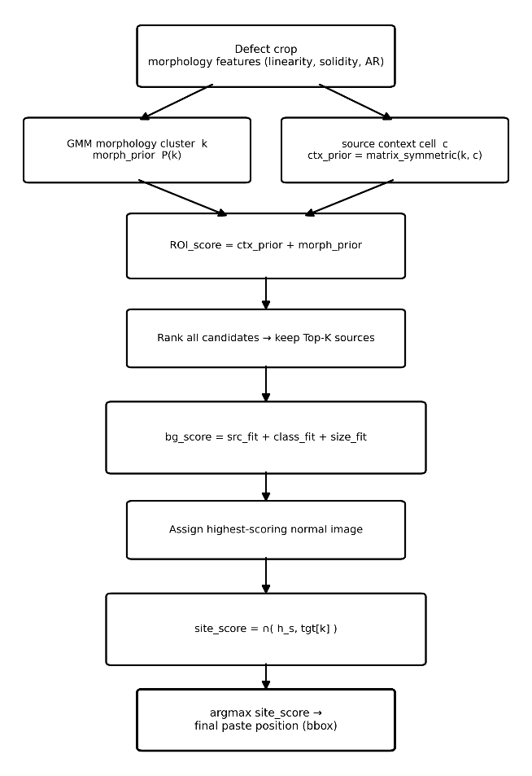

**그림 5-7.** ROI 선택 및 호환성 기반 배치 흐름

배치 위치가 확정되면 각 ROI에 배정할 정상 배경 이미지를 결정한다. 배경
후보는 히스토그램 교차 ∩(a,b) = Σ_c min(a(c), b(c))를 기반으로 한 세
가지 적합도 — 원본 결함 주변 분포와의 일치도 src_fit, 클래스 프로파일과의
일치도 class_fit, 결함 크기 수용 여부 size_fit — 의 합
bg_score = src_fit + class_fit + size_fit으로 순위화하며, 점수가 가장
높은 정상 이미지가 배경으로 배정된다(그림 5-8).

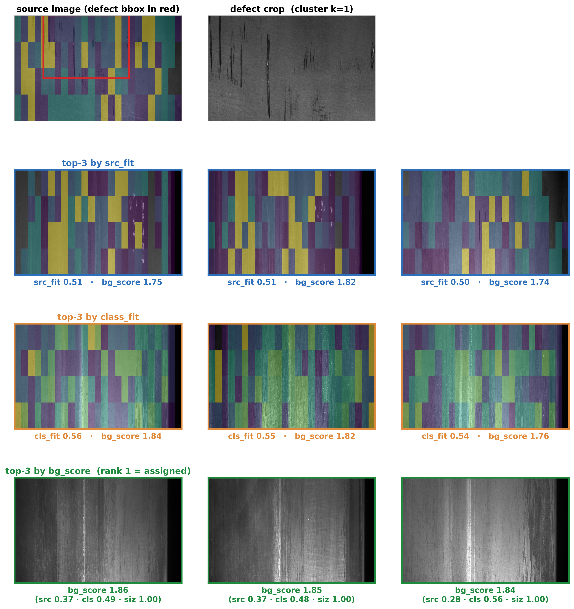

**그림 5-8.** 실제 이미지에서의 배경 할당

그림 5-8은 두 히스토그램 기반 척도가 후보 풀의 서로 다른 측면에
반응하고, 최종 bg_score 순위가 이를 결합해 배경을 확정하는 과정을
보여준다.

배정된 배경 안에서의 삽입 위치는 후보 위치 s의 결함 크롭을 둘러싼
고리(ring) 영역을 맥락 셀 히스토그램 h_s로 변환한 뒤, 해당 결함
클러스터 k의 대칭 호환성 행 tgt[k]와의 교차값
site_score = ∩(h_s, tgt[k])이 최대가 되는 지점으로 확정한다(그림 5-9).
즉 배치는 기하학적 휴리스틱이나 무작위 선택이 아니라, 그 결함 형태가
실제 데이터에서 관측된 맥락과 주변이 가장 유사한 위치로 결정된다.

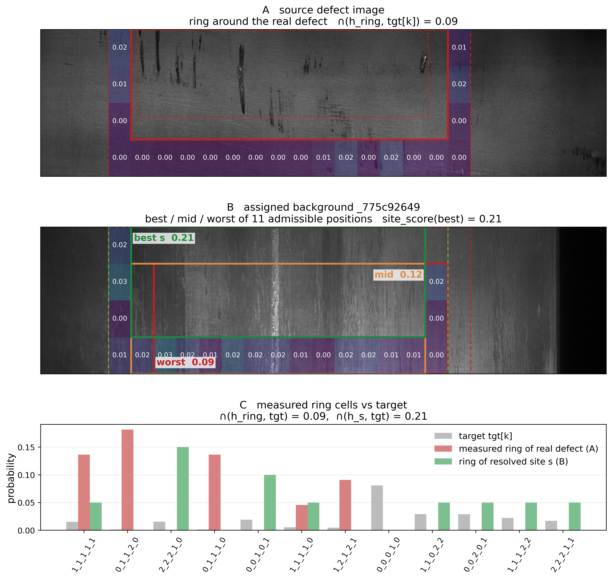

**그림 5-9.** 원본 결함의 ring 맥락과 확정된 배치 위치 비교

그림 5-9에서 원본 이미지의 결함을 둘러싼 타일과 배정된 배경에서 선택된
위치를 둘러싼 타일은 동일한 색상 척도의 tgt[k] 질량으로 착색되어,
교차 점수가 보상하는 유사성이 직접 드러난다.

생성모델 품질과 배치 정책의 효과를 분리하기 위해, 학습이 필요
없는(training-free) copy-paste 합성 엔진(gradient-domain/alpha
blending)을 사용해 AROMA와 Random 배치를 동일한 합성 예산·동일한
blending 연산으로 비교한다. 각 데이터셋의 분할과 조건별 합성 예산은 표
5-4와 같다.

**표 5-4. 데이터셋 분할 및 증강 규모**

+-----------+-------+------+-------+----------+-------+--------------+
| **        | **Dom | **Go | **Def | **Trai   | **    | **Classes**  |
| Dataset** | ain** | od** | ect** | n/Test** | Synth |              |
|           |       |      |       |          | per** |              |
|           |       | **   | **I   |          |       |              |
|           |       | Imag | nstan |          | **C   |              |
|           |       | es** | ces** |          | ondit |              |
|           |       |      |       |          | ion** |              |
+===========+=======+======+=======+==========+=======+==============+
| AITeX     | Te    | 7169 | 352   | 5018 /   | 600   | 1            |
|           | xtile |      |       | 2151     |       | (단일클래스, |
|           |       |      |       |          |       | 타일형)      |
+-----------+-------+------+-------+----------+-------+--------------+
| Kolektor  | Metal | 347  | 52    | 243 /    | 600   | 1            |
|           |       |      |       | 104      |       | (단일클래스) |
+-----------+-------+------+-------+----------+-------+--------------+
| Severstal | Steel | 5902 | 3620  | 4131 /   | 600   | 4            |
|           |       |      |       | 1771     |       |              |
+-----------+-------+------+-------+----------+-------+--------------+
| MTD       | Ce    | 956  | 388   | 669 /    | 600   | 5            |
|           | ramic |      |       | 287      |       |              |
+-----------+-------+------+-------+----------+-------+--------------+
| MVTec     | Le    | 245  | 92    | 172 / 73 | 600   | 5            |
| Leather   | ather |      |       |          |       |              |
+-----------+-------+------+-------+----------+-------+--------------+

### 5.2.5 합성 (Blending Synthesis)

선택된 결함 패치는 지정된 bounding box 위치에서 대상 정상 이미지에
배치된다. AROMA와 random-ROI 두 조건 모두에 동일하게 적용되는 blend
연산자를 사용하므로, blending이 혼동 변수(confounding factor)가 되지
않는다. 이를 통해 ROI 배치 메커니즘의 순수한 효과만 평가할 수 있다.

각 합성 이미지마다 대응하는 결함 마스크와 bounding box를 함께 저장하여,
후속 검출 모델에 픽셀 단위의 지역화 정보를 제공한다.

다운스트림 평가는 YOLOv8n 지도학습 객체탐지로 수행하며,
Baseline(원본만)/Random-ROI/AROMA 세 조건을 각각 3개 시드(1, 2, 42)로
학습해 동일한 실제 테스트셋에서 mAP@0.5로 비교한다. 합성 이미지는 학습
분할에만 추가하고 테스트 분할은 전부 실제 이미지로 구성하여 합성
데이터와 평가 데이터를 엄격히 분리하였다. 학습 하이퍼파라미터는 세
조건에 동일하게 적용하였다(epoch 100, early stopping patience 50,
validation fraction 0.3, batch size 64). 입력 해상도는 다중클래스
데이터셋(Severstal·MTD·MVTec Leather)에서 imgsz 640과 직사각형 학습을
사용하고, 단일클래스 데이터셋은 단일 합성 결함 클래스로 학습하되
Kolektor는 imgsz 640, 타일이 정방형인 AITeX는 imgsz 256에 직사각형
학습을 비활성화하였다.

## 5.3 실험 결과

ROI 선택 메커니즘을 평가한 결과(그림 5-10),
선택 개수를 동일하게 맞춘 비교(큰 쪽 집합을 고정 시드로 하위표집)에서
AROMA와 Random 모두 모든 형태 클러스터를 커버하였으며, 맥락(context)
커버리지는 5개 데이터셋 전부에서 Random이 동등하거나 더 높았다(차이가
가장 큰 MTD는 0.85 대 0.48). 이는 AROMA가 배치를 호환 가능한 셀에
집중시키는 설계상의 필연적 결과다. 반면 희귀 쌍(rare-pair) 커버리지는
쌍별 쿼터에 의해 AITeX(1.00 대 0.87)·Severstal(0.99 대 0.93)·MTD(1.00 대
0.68)에서 Random과 동등하거나 우세했고, Kolektor만 예외였으며(0.60 대
1.00), MVTec Leather의 후보 풀에는 희귀 쌍 자체가 존재하지 않았다. 이는
AROMA가 배치의 폭보다 호환성을 우선한 결과이며, 그 다운스트림 효과는
아래 검출 성능에서 확인된다.

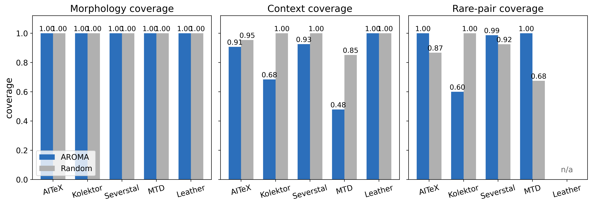

**그림 5-10.** ROI 배치 커버리지 비교

그림 5-10은 형태·맥락·희귀 쌍 세 축의 커버리지를 AROMA와 동일 크기의
균일 무작위 선택 사이에서 비교한 것이다.

ROI 선택과 별개로 배경 선택 메커니즘 자체의 효과를 검증하기 위해, 동일한
ROI 집합과 결함 인스턴스를 공유하되 배경 이미지 할당만 무작위화한
대조군을 구성하였다(그림 5-11, 그림 5-12). 각 ROI에 할당된 정상 배경의
텍스처(밝기·gradient 크기·국소 분산)와, 데이터셋별 실제 결함 주변 배경을
모아 만든 참조 히스토그램 간 교차값(0\~1, 높을수록 유사)을 계산하고, 두
조건을 단측 Mann--Whitney U 검정으로 비교하였다. 그 결과 5개 데이터셋 중
4개에서 AROMA의 배경 할당이 Random보다 유의하게 높은 유사도를
보였다(AITeX: Δ = +0.071, p = 1.7×10⁻¹¹; Severstal: Δ = +0.032, p =
3.1×10⁻²³; Kolektor: Δ = +0.015, p = 1.2×10⁻⁴; MVTec Leather: Δ =
+0.079, p = 2.8×10⁻⁴²). 유일한 예외는 MTD로, 차이는 있었으나 통계적으로
유의하지 않았다(Δ = +0.005, p = 0.25). 이는 AROMA의 호환성 게이트가 ROI
위치 선정뿐 아니라 배경 이미지 자체의 선택에서도 실제 결함 맥락과 더
가까운 배경을 일관되게 골라낸다는 것을 보여준다.

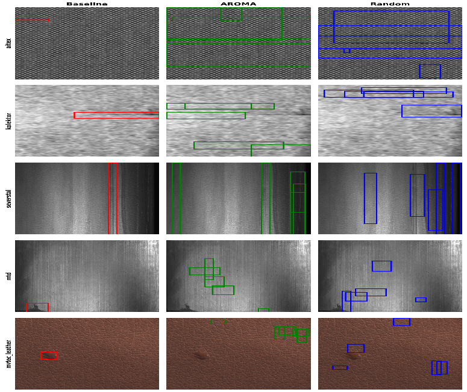

**그림 5-11.** 정성적 ROI 배치 비교

그림 5-11은 데이터셋마다 고정한 대표 이미지 한 장에 동일한 호환성
스캔 함수와 균일 무작위 배치 함수를 직접 호출해 얻은 결과로, 배치
메커니즘 자체를 보여주기 위한 구성된 예시다.

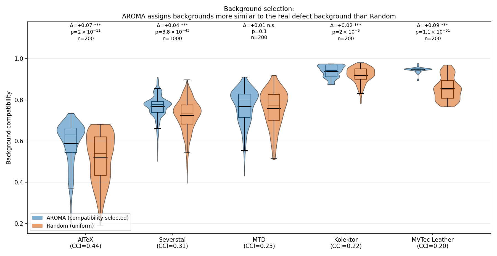

**그림 5-12.** 배경 선택 호환성 비교

단일 클래스 데이터셋에서는 뚜렷한 대조가 나타난다(표 5-5, 표 5-6).

**표 5-5. AITeX YOLOv8n 검출 성능 (mean ± std, n=3 seeds)**

  -----------------------------------------------------------------------
  **Method**                          **mAP@0.5**
  ----------------------------------- -----------------------------------
  Baseline                            0.2039 ± 0.1138

  Random                              0.4187 ± 0.0514

  AROMA                               0.4683 ± 0.0461
  -----------------------------------------------------------------------

**표 5-6. Kolektor YOLOv8n 검출 성능 (mean ± std, n=3 seeds)**

  -----------------------------------------------------------------------
  **Method**                          **mAP@0.5**
  ----------------------------------- -----------------------------------
  Baseline                            0.9740 ± 0.0225

  Random                              0.9938 ± 0.0020

  AROMA                               0.9870 ± 0.0139
  -----------------------------------------------------------------------

고-CCI(0.440)이면서 baseline이 낮은(0.2039) AITeX에서는 AROMA가
0.4683으로 Baseline 대비 +26.44 pp, Random 대비 +4.96 pp
개선되었다(그림 5-13). 반면 저-CCI(0.224)이고
이미 baseline이 near-ceiling(0.9740)인 Kolektor에서는 AROMA(0.9870)가
오히려 Random(0.9938) 대비 -0.68 pp로, 개선 여지가 없으면 배치 정책의
효과 자체가 사라짐을 보여준다(그림 5-14).

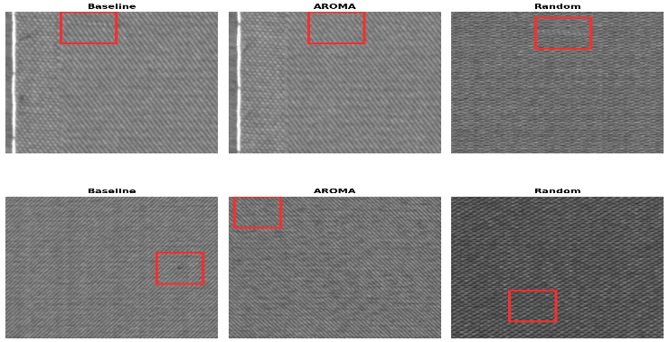

**그림 5-13.** AITeX ROI 비교

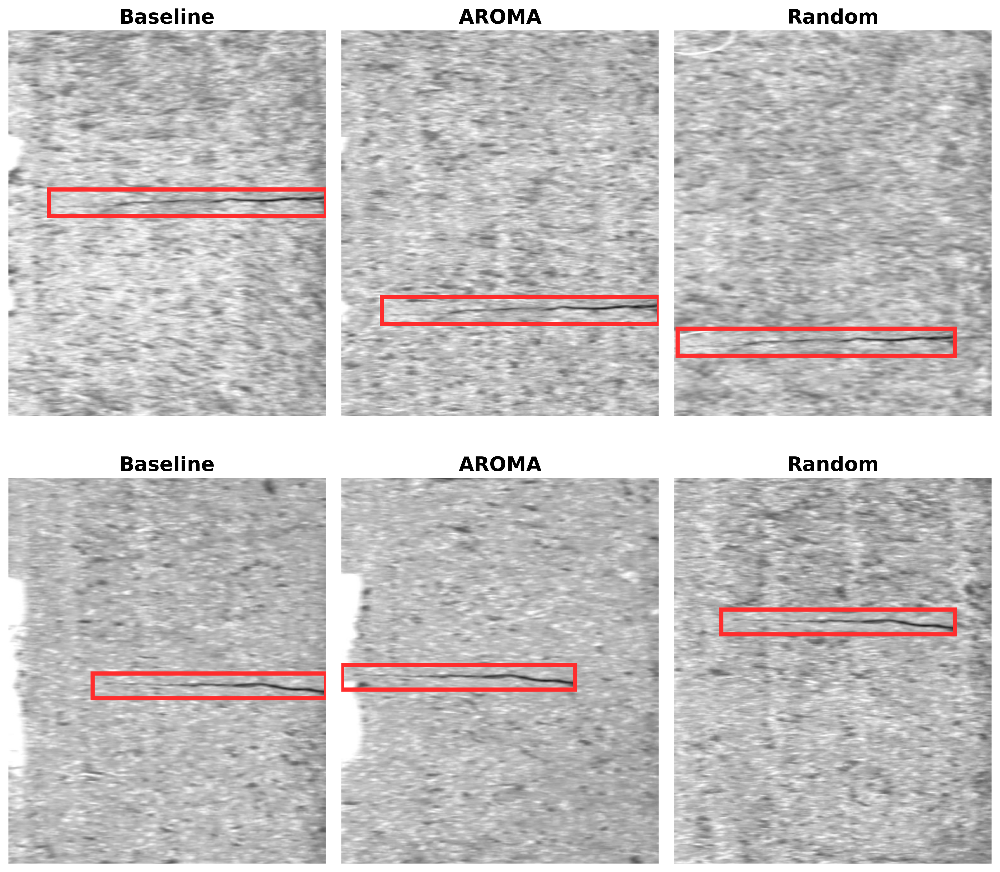

**그림 5-14.** Kolektor ROI 비교

그림 5-13과 그림 5-14는 각 데이터셋에서 제안 절차의 단계별 샘플
이미지를 제시한다.

다중 클래스 데이터셋에서도 동일한 패턴이 관찰된다(표 5-7\~5-9).

**표 5-7. Severstal YOLOv8n 검출 성능 (4-class, mean ± std, n=3 seeds)**

  -----------------------------------------------------------------------
  **Method**                          **mAP@0.5**
  ----------------------------------- -----------------------------------
  Baseline                            0.4959 ± 0.0271

  Random                              0.4935 ± 0.0086

  AROMA                               0.5041 ± 0.0181
  -----------------------------------------------------------------------

**표 5-8. MTD YOLOv8n 검출 성능 (5-class, mean ± std, n=3 seeds)**

  -----------------------------------------------------------------------
  **Method**                          **mAP@0.5**
  ----------------------------------- -----------------------------------
  Baseline                            0.9094 ± 0.0274

  Random                              0.9465 ± 0.0166

  AROMA                               0.9440 ± 0.0152
  -----------------------------------------------------------------------

**표 5-9. MVTec Leather YOLOv8n 검출 성능 (5-class, mean ± std, n=3
seeds)**

  -----------------------------------------------------------------------
  **Method**                          **mAP@0.5**
  ----------------------------------- -----------------------------------
  Baseline                            0.8321 ± 0.0643

  Random                              0.8543 ± 0.0048

  AROMA                               0.8052 ± 0.0421
  -----------------------------------------------------------------------

중간 CCI(0.306)의 Severstal은 AROMA가 Random 대비 +1.06 pp로 양의 방향을
유지하며 클래스별로도 c1 +1.48 pp, c2 +1.04 pp, c4 +2.09 pp로 대체로
균형된 이득을 보이나, 과소표집 클래스인 c2는 세 조건 모두에서 여전히
가장 낮은 수준(AROMA 0.3330)에 머문다(그림 5-15). 근-ceiling 저-CCI(0.246)의 MTD는 -0.25 pp로 수렴하고(그림 5-16), 저-CCI(0.200)·균질 배경의 MVTec Leather는
-4.91 pp로 오히려 역전된다(그림 5-17).
MVTec Leather의 하락은 그림에서도 볼 수 있듯이, 전체적으로 유사한 표면
위주라, AROMA 와 RANDOM 방식의 차이가 크게 존재하지 않는점을 확인할 수
있다.

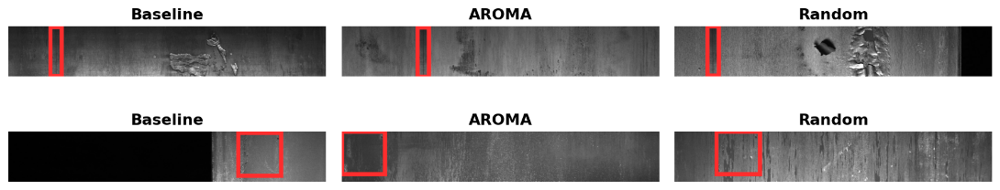

**그림 5-15.** Severstal ROI 비교

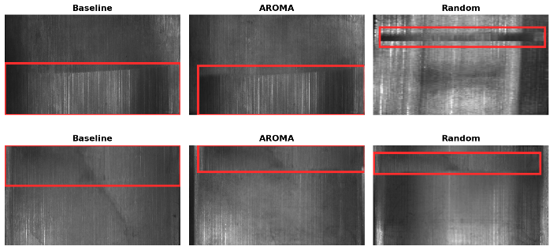

**그림 5-16.** MTD ROI 비교

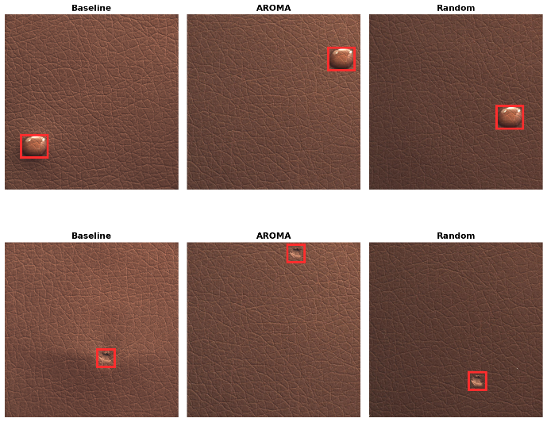

**그림 5-17.** MVTec Leather ROI 비교

종합하면, AITeX(+4.96 pp)→Severstal(+1.06 pp)→MTD(-0.25 pp)→MVTec
Leather(-4.91 pp)로 이어지는 순서는 CCI가 높은 순서와 정확히 일치한다.
즉 context-aware ROI 선택의 효과는 baseline 개선 여지와 배경 맥락
복잡도(CCI) 두 조건이 동시에 충족될 때만 나타나며, 어느 하나라도
결여되면 무작위 배치와 차이가 없거나 오히려 역전된다.
AITeX·Severstal에서 관찰된 것은 시드 간 부호가 일관된 양의 방향성이며,
AROMA와 Random 간 차이는 3개 시드의 대응 비교(paired t, df=2)에서
통계적 유의성에 이르지 못하였다. 따라서 본 장의 주장은 개별 격차의
크기나 유의성이 아니라 CCI를 따라 부호가 순서대로 뒤집히는 패턴 자체에
근거한다.

## 5.4 한계 및 다음 단계로의 연결

AROMA는 여러 산업 도메인에 재설계 없이 일반화되는 자동화된 ROI 검출·배치
프레임워크를 확립했지만, 여전히 \"기존 결함 patch를 재배치\"하는
copy-paste 프레임에 머무른다. 결함 자체의 신규 생성이 아니라 배치 위치
최적화에 집중하므로, 하위유형별 변형을 넘어서는 결함 형태 다양성은
확보하지 못한다. 또한 본 장의 비교는 게이트가 전혀 없는 무작위 배치를
대조군으로 삼은 프레임워크 전체 수준의 비교이므로, 호환성 임계값과 정상
배경 게이트 각 성분의 개별 기여나 두 prior(ctx_prior, morph_prior) 결합
방식의 타당성은 절제 실험으로 검증되지 않았다. 제6장(CASDA)은 이 자동화된 ROI 접근을 강철
표면(Severstal)이라는 특정 도메인으로 좁혀 특화시키고, 여기에 ControlNet
기반 생성모델을 결합해 결함 자체를 새로 합성함으로써 copy-paste의 재사용
한계를 넘어선다.

# 제6장 CASDA: Context-Aware Steel Defect Augmentation

## 6.1 개요

CASDA \[31\]는 제5장(AROMA)이 확립한 자동화된 ROI 검출·copy-paste 프레임워크를
강철 표면(Severstal) 단일 도메인에 특화시킨 연구다. 도메인을 좁히는
대신, 결함 형태와 배경 표면 속성의 관계를 인코딩한 호환성 매트릭스를
구성하고, ControlNet 파이프라인으로 3채널 힌트 이미지 기반의 결함
이미지를 새로 생성하여 copy-paste에 결합한다. 즉 \"어디에
배치할지\"(ROI)뿐 아니라 \"무엇을 배치할지\"(결함 자체)까지 생성적으로
확장한 5단계 프레임워크이며, Severstal 철강 결함 데이터셋으로
검증하였다.

## 6.2 방법론: 5단계 파이프라인

Severstal Steel Defect Detection 데이터셋 \[51\]은 다수의 결함 클래스가 서로
다른 형태적 특성과 발생 빈도를 가지며, 특히 Class 2가 심각하게
과소표집되어 있어 클래스 불균형 조건에서 증강 기법을 검증하기에 적합한
테스트베드다. 모든 이미지는 1600×256 해상도의 그레이스케일 영상으로,
실제 산업 환경의 표면 결함 특성을 반영한다. 데이터셋은 학습:검증:테스트
= 70:15:15로 분할하였는데, 이는 80:10:10 대안보다 테스트 샘플을 약
1,000장 수준으로 유지해 클래스별 성능 평가의 통계적 신뢰성을 높이기
위함이다. 전체 파이프라인은 그림 6-1과 같이 5단계로 구성된다.

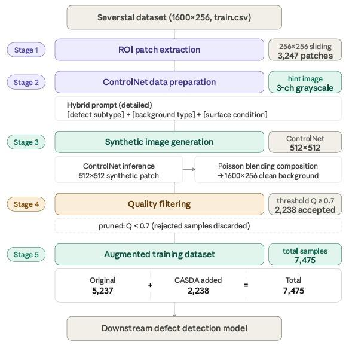

**그림 6-1.** CASDA 파이프라인

**1단계: 기하학적 ROI 특성화.** 결함 마스크의 공분산 행렬 고유값 분해로
linearity를, 볼록껍질 대비 실제 면적비로 solidity를, bounding box 대비
면적비로 area ratio(extent)를, 최소자승 타원 적합의 장단축비로 aspect
ratio를 계산하여 결함을 linear_scratch/irregular/compact_blob/general
4개 유형으로 분류한다(그림 6-2). 결함 유형 분류 수식(고정
기준)은 다음과 같다:

$$\text{linear\_scratch} \Leftrightarrow \lambda > 0.85 \land \alpha > 5.0$$

$$\text{irregular} \Leftrightarrow \sigma < 0.7$$

$$\text{compact\_blob} \Leftrightarrow \alpha < 2.0 \land \sigma > 0.9$$

$$\text{general} \Leftrightarrow \text{otherwise}$$

여기서: $\lambda$ = 선형성(Linearity), $\sigma$ = 건고도(Solidity),
$\alpha$ = 종횡비(Aspect Ratio)

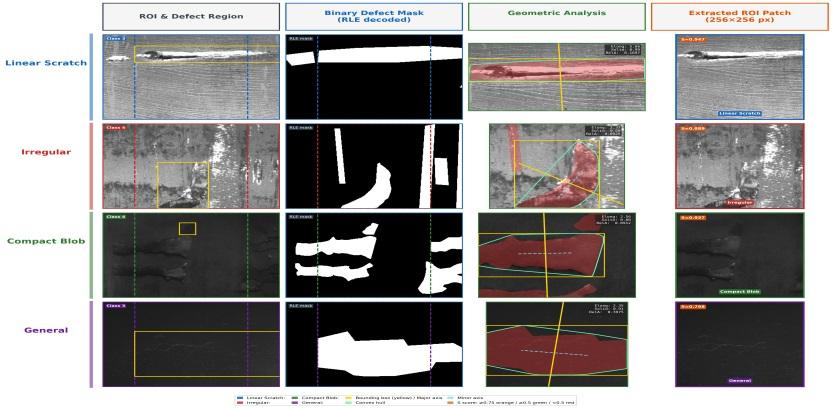

**그림 6-2.** 기하학적 ROI 특성화 파이프라인

그림 6-2의 각 행은 결함 하위유형(Linear Scratch, Irregular, Compact
Blob, General)에, 각 열은 처리 단계에 대응한다. ROI 윈도우와 결함
bounding box가 표시된 철강 이미지 크롭에서 시작해 이진 결함 마스크를
거쳐 기하 지표가 산출되는 과정을 보여준다.

위 임계값은 수작업으로 정한 것이 아니라 전체 결함 인스턴스
분포(N=19,958)에서 도출하였다. 높은 경계의 임계값($\lambda$=0.85,
$\sigma$=0.9)에는 로그 스케일 Otsu 분할을 적용하였다(그림 6-3).

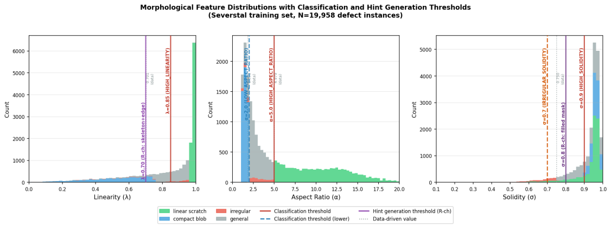

**그림 6-3.** 형태 특성 분포 — (1) linearity($\lambda$), (2) aspect
ratio($\alpha$), (3) solidity($\sigma$)

배경 표면 또한 64픽셀 슬라이딩 그리드 위에서 Canny 엣지 밀도와 Sobel
방향성 맵으로 분석해 Smooth, Vertical Stripe, Horizontal Stripe,
Textured, Complex 5개 유형으로 분류한다(그림 6-4). 배경 텍스처 분류에는 Severstal 기반의 고정 임계값을 사용한다:

$$\text{Smooth} = \text{LocalVariance} \leq 14.09$$

$$\text{Complex} = \text{LocalVariance} > 14.09\text{ 또는 }\text{EdgeDensity} > 0.607$$

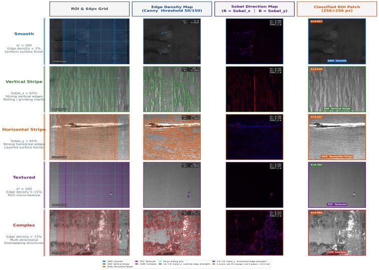

**그림 6-4.** 배경 텍스처 분류 파이프라인

그림 6-4의 각 행은 배경 유형(Smooth, Vertical Stripe, Horizontal
Stripe, Textured, Complex)에, 각 열은 처리 단계에 대응한다. 64픽셀
슬라이딩 그리드와 ROI 윈도우가 표시된 크롭에서 Canny 엣지 맵과 Sobel
방향성 맵을 거쳐 배경 유형이 결정된다.

배경 적합도 임계값(분산 $\tau$=14.09, 엣지 $\varepsilon$=0.607) 역시
정상 배경 패치 집합의 분포에서 동일한 방식으로 도출하였다. 분산
임계값은 로그 스케일 분할로 저분산(매끄러운 철강 표면) 주모집단과
고분산 꼬리를 분리하고(그림 6-5), 엣지 임계값은 같은 패치 집합의 엣지
밀도 분포에서 도출하였다(그림 6-6). 저분산·저엣지 배경만 선택함으로써
합성된 결함 영역과 주변 배경 사이의 도메인 불일치를 직접 줄인다.

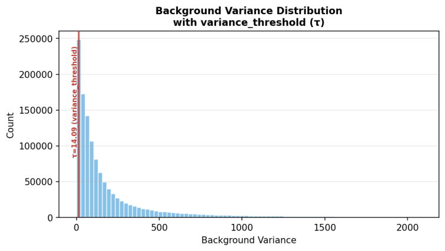

**그림 6-5.** 정상 배경 패치에서 계산한 패치별 배경 분산 분포

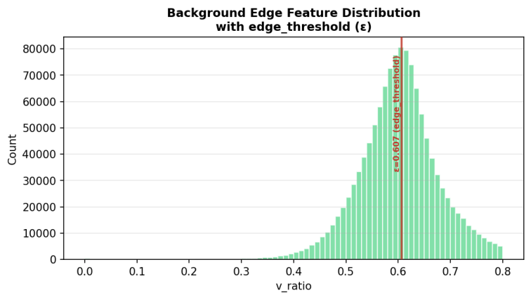

**그림 6-6.** 동일 패치 집합에서 계산한 배경 엣지 밀도 분포

매칭 품질·공간
연속성·배경 안정성을 통합한 ROI 적합도 점수를 산출한 결과, 학습
데이터셋에서 추출한 전체 3,247개 ROI의 평균 적합도는 0.68이었으며,
고품질군(61.3%, 1,990개)은 템플릿으로, 사용가능군(31.5%, 1,022개)은
선택적으로 사용하고, 제외군(7.2%, 235개)은 템플릿 풀에서 배제하였다(표
6-1).

**표 6-1. ROI 적합도 분류 결과**

  ------------------------------------------------------------------------
  **그룹**              **비율**   **개수**   **용도**
  --------------------- ---------- ---------- ----------------------------
  고품질군              61.3%      1,990      고품질 템플릿으로 사용
  (High-quality)                              

  사용가능군            31.5%      1,022      선택적으로 사용
  (Acceptable)                                

  제외군 (Excluded)     7.2%       235        템플릿 풀에서 제외
  ------------------------------------------------------------------------

1단계에서 분류된 각 결함 하위유형과 배경 유형의 대표 ROI 샘플은
그림 6-7과 같다.

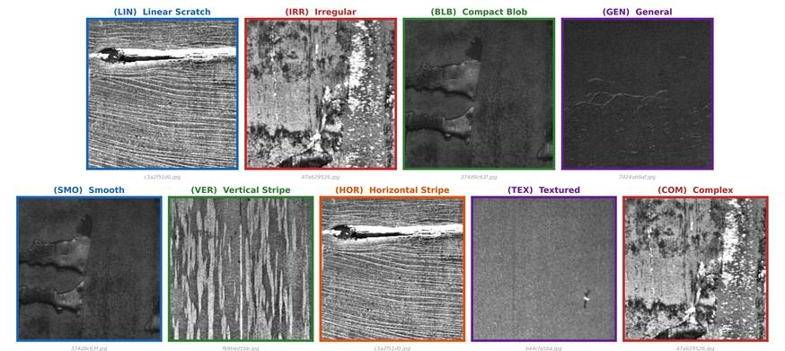

**그림 6-7.** CASDA 1단계에서 분류된 결함 하위유형별(상단)·배경
유형별(하단) 대표 ROI 샘플

**2단계: ControlNet 구성.** ControlNet \[30\]
구현체(lllyasviel/sd-controlnet-canny)를 Stable Diffusion
v1.5 \[24\](runwayml/stable-diffusion-v1-5) 기반으로 초기화하고, 결함 ROI 데이터셋에
대해 AdamW(lr=1×10⁻⁵, cosine scheduler, warmup 50 step), min-SNR
weighting(γ=5.0), 유효 배치 4(배치1×누적4)로 최대 20 epoch
fine-tuning한다(FP16, Google Colab T4, 학습 시 ControlNet conditioning
scale 1.0, early stopping patience 20, random seed 42). 추론 시에는 30
denoising step, classifier-free guidance scale 7.5, ControlNet
conditioning scale 0.7을 적용하고, 생성된 RGB 출력은 단일 채널 철강 표면
이미지의 VAE 디코더 색상 아티팩트를 제거하기 위해 그레이스케일로
변환한다. 3채널 힌트 이미지는 R채널(결함의 픽셀 단위 기하), G채널(Sobel
연산 기반 표면 방향성), B채널(7×7 커널 국소 분산 기반 표면 거칠기)을
0.5R + 0.3G + 0.2B로 결합해 구성하며(그림 6-8), 프롬프트는 F1(결함 유형)·F2(배경 표면)·F3(방향성
텍스처)·F4(안정성 점수 기반 표면 상태) 4개 시맨틱 필드를 고정 템플릿으로
연결해 자동 생성한다. 예를 들어 vertical_stripe 배경 위의 linear_scratch
결함(F4=0.85)은 \"a linear scratch defect on vertical striped metal
surface with directional texture (pristine), class 2.\"라는 프롬프트로
변환된다.

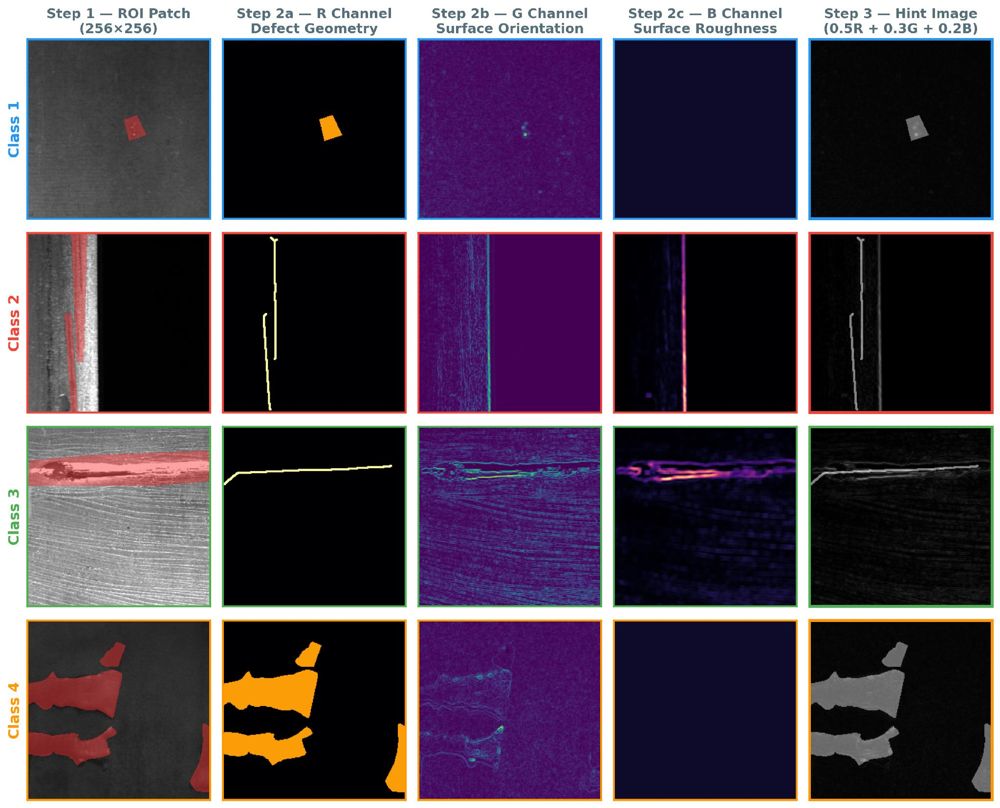

**그림 6-8.** CASDA 2단계의 3채널 힌트 이미지 구성

그림 6-8의 각 행은 결함 클래스(Class 1~4)에, 각 열은 구성 단계에
대응한다. 결함 마스크를 오버레이한 ROI 패치에서 시작해 형태 특성 기반
R채널, 표면 방향성 G채널, 표면 거칠기 B채널을 거쳐 최종 힌트 이미지가
만들어진다.

**3단계: 맥락 기반 합성.** 결함 유형과 배경 텍스처 간 공존 확률을
인코딩한 호환성 매트릭스를 구성하고, 이 매트릭스에 따라 배경을
확률적으로 선택한다. ControlNet으로 생성한 결함 이미지를 선택된 배경에
삽입할 때는 Poisson blending \[36\]을 적용해 경계 불연속을 제거하고
시각적 자연스러움을 확보한다.

**4단계: 품질 검증 게이트.** 형태 일관성(Q_morph), 선명도(Q_sharp),
아티팩트 유무(Q_artifact), 면적비(Q_area)의 가중합 Q를 계산해 Q ≥ 0.7인
샘플만 학습 데이터로 채택함으로써 저품질 입력으로 인한 성능 저하를
방지한다.

**5단계: 데이터셋 통합.** 채택된 합성 이미지의 결함 마스크를 인코딩해
기존 학습 데이터셋에 통합, 데이터 다양성과 클래스 균형이 개선된 최종
학습 데이터셋을 구성한다.

**표 6-2. 증강 통계 요약**

  -----------------------------------------------------------------------
  **항목**                      **값**
  ----------------------------- -----------------------------------------
  품질 검증 배치의 생성 후보    2,500

  해당 배치의 품질 검증 통과    2,075 (83.0%)

  Class 2 표본 수               247 → 519 (증강률 110.1%)

  최종 통합 합성 표본           2,238

  최종 학습 데이터셋            7,475 (= 원본 5,237 + 합성 2,238)

  원본 대비 증강 비율           42.7% (= 합성 2,238 / 원본 5,237)
  -----------------------------------------------------------------------

Class 2는 데이터 희소성이 가장 심각한 클래스로, 기존 247개에서 519개로
확대되어 110.1%라는 가장 높은 증강률을 기록하였다. 품질 검증 통과율
83.0%는 2,500장 규모의 생성 후보 배치를 대상으로 산출한 값이며,
최종적으로 학습 데이터셋에 통합된 합성 표본은 2,238장이다. 즉 최종 학습
데이터셋은 원본 5,237장에 합성 2,238장을 더한 7,475장이며, 원본 대비
증강 비율 42.7%는 생성 데이터의 다양성을 활용하면서도 원본 데이터의
분포적 특성을 보존하기 위해 의도적으로 유지한 수치다.

## 6.3 실험 결과

제안 프레임워크의 다운스트림 효과를 검증하기 위해 BiFPN을 도입한
EB-YOLOv8을 벤치마크 아키텍처로 선정하고, 두 개의 독립 시드(42, 456)로
결과 안정성을 평가하였다. 표 6-3에서 표준편차가 0.0000인 항목은 두
시드가 완전히 동일한 평가 결과를 산출한 경우로, 해당 모델--조건 조합이
시드 변동에 둔감함을 의미한다.

**표 6-3. EB-YOLOv8 검출 성능 (Severstal, mean ± std, n=2 seeds)**

  ------------------------------------------------------------------------
  **Method**     **mAP@0.5**   **Class 1  **Class 2  **Class 3  **Class 4
                               AP**       AP**       AP**       AP**
  -------------- ------------- ---------- ---------- ---------- ----------
  Baseline (Raw) 0.2936 ±      0.1490 ±   0.2548 ±   0.3966 ±   0.3739 ±
                 0.0000        0.0000     0.0000     0.0000     0.0000

  Copy-Paste     0.2722 ±      0.1479 ±   0.0550 ±   0.4594 ±   0.4266 ±
                 0.0304        0.0558     0.0000     0.0488     0.0172

  CASDA          0.3196 ±      0.2493 ±   0.2759 ±   0.4287 ±   0.3246 ±
                 0.0192        0.0056     0.0250     0.0094     0.0670

  CASDA vs. Raw  +2.60 pp      +10.03 pp  +2.11 pp   +3.21 pp   −4.93 pp

  CASDA vs.      +4.74 pp      +10.14 pp  +22.09 pp  −3.07 pp   −10.20 pp
  Copy-Paste                                                    
  ------------------------------------------------------------------------

EB-YOLOv8에서는 CASDA가 mAP@0.5 0.3196으로 Baseline(+2.60 pp)과
Copy-Paste(+4.74 pp) 모두를 상회하였고, 데이터 희소성이 가장 심각한
Class 2 AP가 Raw 대비 +2.11 pp, 단순 patch 재사용 방식인 Copy-Paste 대비
+22.09 pp 개선되어, ControlNet 기반 context-aware 합성이 단순 patch
재사용보다 판별력이 높은 minority-class 학습 샘플을 생성함을 확인하였다.
클래스별로는 Class 1 AP가 Raw 대비 +10.03 pp로 가장 큰 향상을 보였으나,
Class 4 AP는 Raw 대비 −4.93 pp·Copy-Paste 대비 −10.20 pp, Class 3 AP는
Copy-Paste 대비 −3.07 pp로 하락하여, 전체 mAP 개선이 모든 클래스에
균일하게 나타난 것은 아니다.

합성 품질은 FID, KID, LPIPS(정의는 2.7절 참조)로 평가하였다. FID는 Copy-Paste(61.4)가
CASDA(228.6)보다 낮게 나타나지만, 이는 Copy-Paste가 실제 patch를 그대로
재사용해 feature 분포가 참조셋과 구조적으로 동일해지는 특성에서 기인한
것으로, 직접적인 품질 비교로 해석하지 않는다. 반면 경계 아티팩트를
포함하는 LPIPS Realism에서는 CASDA(0.467)가 Copy-Paste(0.491)보다 우수해
Poisson blending이 경계 아티팩트를 효과적으로 제거함을 확인하였다(개선
폭은 Class 1 Δ=0.116, Class 4 Δ=0.060에서 가장 컸다). 다만 Class 2는
CASDA가 Copy-Paste보다 열세인 유일한 클래스였으며, 이는 Class 2 결함의
불규칙한 텍스처로 ControlNet 생성 난이도가 높았던 데 기인한다. 실제로
FID(357.4)와 KID(58.83 ± 3.13) 모두 Class 2에서 가장 높게 나타나, 이
격차가 blending 단계가 아니라 생성 단계에서 비롯됨을 두 독립 지표가 함께
뒷받침한다. 한편 LPIPS Diversity에서도 CASDA(0.448)가
Copy-Paste(0.394)를 상회해 단순 patch 재조합을 넘어선 구조적 다양성을
확보했음을 보여준다. 동일한 힌트 조건에서도 매번 시각적으로 다른 결함이
생성됨을 확인할 수 있어, CASDA가 단순 복제가 아닌 실질적인 데이터 다양성
확장을 이룬다는 것을 뒷받침한다(그림 6-9).

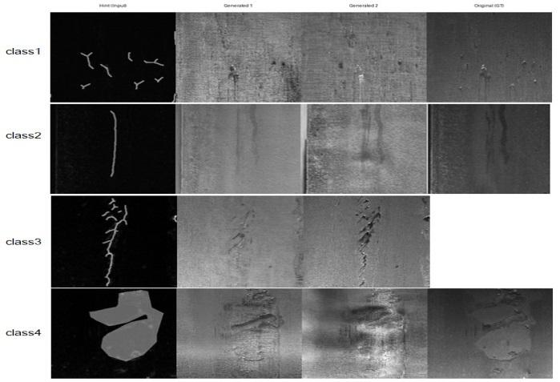

**그림 6-9.** CASDA 3단계에서 ControlNet으로 생성한 결함 샘플

그림 6-9는 동일한 힌트 조건에서 생성된 결함 샘플을 원본 GT와 비교한
것으로, 단일 힌트 입력에서 시각적으로 서로 다른 복수의 출력이 산출됨을
보여준다.

## 6.4 한계

본 장의 결과는 두 개의 시드(n=2)로 수행한 소규모 실험에 기반한다. 참고로
실시한 형식적 가설 검정(Wilcoxon signed-rank, BH-FDR 보정, α=0.05)은
유의수준에 도달하지 못하였고, 효과크기 또한 Class 2 개선이 d=0.47, CASDA
대 Copy-Paste 전체 mAP가 d=0.19로 작거나 미미하였다. 따라서 본 장의
수치는 확정적 결론이 아니라 기술 통계로서 제시한다.

또한 ROI 매칭이 결함 주변 배경의 통계적 속성에 크게 의존하므로, 제조
현장마다 상이한 결함 발생 양상을 모두 설명하지는 못한다. 이는 본 논문
서사의 최종 한계점이며, 이를 해소하기 위한 방향은 별도의 향후 연구
챕터에서 다룬다(본 초안 범위 외).

# 제7장 결론

## 7.1 연구 요약

본 논문은 결함 검출 성능 개선을 위한 데이터 증강 연구를 결함 patch
생성(제3장) → ROI 배치 탐색의 도입(제4장) → ROI 배치의 데이터 기반
자동화(제5장, AROMA) → 자동화된 ROI 프레임워크의 도메인 특화 및 생성적
확장(제6장, CASDA)의 순서로 총정리하였다.

제3장은 YOLOv8과 GAN/Diffusion 생성모델을 결합해 PCB 결함 patch 자체를
증강하고, YOLOv8m Basic 모델이 mAP50-95 0.54로 최고 성능을 보이는 한편
Diffusion 증강이 검출 지표에서는 GAN보다 우수하지만 과적합 측면에서는
GAN이 더 안정적이라는, 성능과 일반화 사이의 트레이드오프를 확인하였다.
그러나 이 연구는 증강된 결함을 원본과 동일한 위치에 재배치할 뿐,
배경과의 호환성을 고려한 배치 위치 선정 문제는 다루지 않았다.

제4장은 이 공백을 메워, ControlNet으로 생성한 결함 패치를 대상으로 결함
주변 배경의 밝기 유사도를 슬라이딩 윈도우로 탐색해 ROI를 선정하고
Poisson blending으로 합성하는 방법을 제안하였다. KolektorSDD 실험에서
ResNet34의 mIoU가 0.5667에서 0.8919로, EfficientNet은 0.1682에서 최대
0.6860까지 향상되어 ROI 배치의 도입이 실질적 성능 개선으로 이어짐을
입증하였다. 다만 ROI 추출이 밝기라는 단일 통계량의 휴리스틱 탐색에 그쳐,
복잡한 배경 텍스처나 결함의 구조적 특성을 반영하지 못하는 한계가 있었다.

제5장(AROMA)은 이 휴리스틱을 patch-level 공존 통계로부터 자동 도출되는
대칭 호환성 게이트로 대체하여, 5개 산업 데이터셋에 재설계 없이
일반화되는 ROI 프레임워크를 확립하였다. 이 호환성 게이트는 ROI 위치
선정뿐 아니라 배경 이미지 자체의 선택에서도 유효함이 확인되었는데, 5개
데이터셋 중 4개에서 AROMA가 할당한 배경이 Random보다 통계적으로 유의하게
실제 결함 맥락에 가까웠다(Mann--Whitney U 검정). 다운스트림 검출 성능
면에서는 context-aware 배치의 효과가 보편적이지 않고, baseline 개선
여지와 배경 맥락 복잡도(CCI)가 동시에 충족되는 조건(AITeX +4.96 pp,
Severstal +1.06 pp)에서만 나타나며, 두 조건 중 하나라도 결여되면 무작위
배치와 수렴하거나 오히려 역전됨(MTD −0.25 pp, Kolektor −0.68 pp, MVTec
Leather −4.91 pp)을 확인하였다. 다만 이 다운스트림 차이는 3개 시드 대응
비교(paired t, df=2)에서 통계적 유의성에는 이르지 못하므로, 유의한
우열이 아니라 CCI 순서와 일치하는 일관된 방향성으로 해석한다. 이는 개별
성능 수치를 넘어, \"언제 context-aware 배치가 유효한가\"에 대한 적용
조건을 제시했다는 방법론적 기여를 갖는다.

제6장(CASDA)은 AROMA가 확립한 자동화된 ROI 프레임워크를 강철
표면(Severstal) 단일 도메인으로 좁히고, ControlNet 기반 생성모델을
결합해 \"어디에 배치할지\"뿐 아니라 \"무엇을 배치할지\"까지 생성적으로
확장하였다. EB-YOLOv8 벤치마크에서 CASDA는 mAP@0.5 0.3196으로 Raw 대비
+2.60 pp, Copy-Paste 대비 +4.74 pp를 기록하였고, 가장 희소한 Class 2
AP는 Raw 대비 +2.11 pp, Copy-Paste(0.0550) 대비 +22.09 pp 개선되어
context-aware 생성이 단순 patch 재사용보다 판별력 있는 minority-class
샘플을 만든다는 것을 확인하였다. 이 결과는 2개 시드(42, 456)의 기술
통계에 기반하며 형식적 유의성 검정은 α=0.05를 통과하지 못하므로 경향으로
해석해야 하지만, 합성 품질 측면에서 LPIPS Diversity가 CASDA 0.448 대
Copy-Paste 0.394로 우세하다는 점이 실제 patch 재사용의 다양성 한계를
넘어섰다는 서사축을 함께 뒷받침한다.

## 7.2 연구의 의의

네 편의 연구는 개별적으로 발표되었으나, 본 논문에서 재구성한 서사를 통해
\"결함 patch를 생성하는 문제\"와 \"생성된 결함을 배치할 위치를 정하는
문제\"라는 두 하위 문제가 점진적으로 분리·정교화·재결합되는 하나의
연속된 궤적임이 드러난다. 특히 AROMA에서 CASDA로의 전환은 일반화(다중
도메인 자동화)와 특화(단일 도메인 생성적 확장)가 상충하지 않고
순차적으로 결합될 수 있음을 보여주는 사례로, 데이터 증강 연구가 \"더
넓게\" 또는 \"더 깊게\" 중 하나만을 택할 필요가 없다는 시사점을
제공한다. 아울러 각 장은 성능 개선뿐 아니라 성능-일반화
트레이드오프(제3장), 증강 비율 과다 시(0.7) ResNet34의 성능 하락(제4장),
baseline 개선 여지와 배경 맥락 복잡도(CCI)가 동시에 충족되지 않을 때의
효과 소멸·역전(제5장), 소규모 시드 실험에 따른 통계적 유의성의
한계(제6장) 등 제안 기법이 실패하거나 무효화되는 조건까지 함께 규명하여,
제안 방법의 적용 범위를 실증적으로 한정하였다.

## 7.3 향후 연구 방향

CASDA의 실험 결과에서는 ROI 매칭이 결함 주변 배경의 통계적 속성에 크게
의존한다는 근본적 한계가 드러나며, 이는 다양한 제조 현장의 결함 발생
양상을 모두 설명하지 못한다는 본 연구 궤적 전체의 최종 한계점으로
이어진다. 이 한계를 다루는 future work(가변 ROI 사이즈 대응, 결함위치가
ROI인 경우의 object detection 선행 등)는 본 초안의 범위에서 제외하며,
별도 챕터로 후속 작성한다.

# 제8장 References

\[1\] Rippel, O.; Merhof, D. Anomaly Detection for Automated Visual
Inspection: A Review. In Bildverarbeitung in der Automation;
Technologien für die intelligente Automation, Vol. 17; Springer, 2023;
pp. 1--13. DOI: 10.1007/978-3-662-66769-9_1.

\[2\] Hütten, N.; Alves Gomes, M.; Hölken, F.; Andricevic, K.; Meyes,
R.; Meisen, T. Deep Learning for Automated Visual Inspection in
Manufacturing and Maintenance: A Survey of Open-Access Papers. Applied
System Innovation. 2024, 7(1), 11. DOI: 10.3390/asi7010011.

\[3\] Stavropoulos, P.; Papacharalampopoulos, A.; Petridis, D. A
Vision-Based System for Real-Time Defect Detection: A Rubber Compound
Part Case Study. Procedia CIRP. 2020, 93, 1230--1235. DOI:
10.1016/j.procir.2020.04.159.

\[4\] Roth, K.; Pemula, L.; Zepeda, J.; Schölkopf, B.; Brox, T.;
Gehler, P. Towards Total Recall in Industrial Anomaly Detection. CVPR.
2022, pp. 14318--14328. DOI: 10.1109/CVPR52688.2022.01392.

\[5\] Batzner, K.; Heckler, L.; König, R. EfficientAD: Accurate Visual
Anomaly Detection at Millisecond-Level Latencies. WACV. 2024, pp.
128--138. DOI: 10.1109/WACV57701.2024.00020.

\[6\] Liu, Z.; Zhou, Y.; Xu, Y.; Wang, Z. SimpleNet: A Simple Network
for Image Anomaly Detection and Localization. CVPR. 2023, pp.
20402--20411. DOI: 10.1109/CVPR52729.2023.01954.

\[7\] Deng, H.; Li, X. Anomaly Detection via Reverse Distillation from
One-Class Embedding. CVPR. 2022, pp. 9737--9746. DOI:
10.1109/CVPR52688.2022.00951.

\[8\] Ruff, L.; Vandermeulen, R.; Görnitz, N.; Binder, A.; Müller, E.;
Kloft, M. Deep One-Class Classification. ICML. 2018. DOI:
10.48550/arXiv.1802.06360.

\[9\] Yang, B.; Lei, Y.; Li, N.; Li, X.; Si, X.; Chen, C. Balance
Recovery and Collaborative Adaptation Approach for Federated Fault
Diagnosis of Inconsistent Machine Groups. Knowledge-Based Systems. 2025,
317, 113480. DOI: 10.1016/j.knosys.2025.113480.

\[10\] Buda, M.; Maki, A.; Mazurowski, M. A. A Systematic Study of the
Class Imbalance Problem in Convolutional Neural Networks. Neural
Networks. 2018, 106, 249--259. DOI: 10.1016/j.neunet.2018.07.011.

\[11\] de Giorgio, A.; Cola, G.; Wang, L. Systematic Review of Class
Imbalance Problems in Manufacturing. Journal of Manufacturing Systems.
2023.

\[12\] Shorten, C.; Khoshgoftaar, T. M. A Survey on Image Data
Augmentation for Deep Learning. Journal of Big Data. 2019, 6, 60. DOI:
10.1186/s40537-019-0197-0.

\[13\] Mumuni, A.; Mumuni, F. Data Augmentation: A Comprehensive Survey
of Modern Approaches. Array. 2022, 16, 100258. DOI:
10.1016/j.array.2022.100258.

\[14\] Kumar, T.; Brennan, R.; Mileo, A.; Bendechache, M. Image Data
Augmentation Approaches: A Comprehensive Survey and Future Directions.
IEEE Access. 2024, 12, 187536--187571. DOI:
10.1109/ACCESS.2024.3470122.

\[15\] Li, C.-L.; Sohn, K.; Yoon, J.; Pfister, T. CutPaste:
Self-Supervised Learning for Anomaly Detection and Localization. CVPR.
2021, pp. 9664--9674. DOI: 10.1109/CVPR46437.2021.00954.

\[16\] Zavrtanik, V.; Kristan, M.; Skočaj, D. DRAEM---A Discriminatively
Trained Reconstruction Embedding for Surface Anomaly Detection. ICCV.
2021, pp. 8330--8339. DOI: 10.1109/ICCV48922.2021.00822.

\[17\] Goodfellow, I.; Pouget-Abadie, J.; Mirza, M.; Xu, B.;
Warde-Farley, D.; Ozair, S.; Courville, A.; Bengio, Y. Generative
Adversarial Nets. NeurIPS. 2014, pp. 2672--2680.

\[18\] Frid-Adar, M.; Diamant, I.; Klang, E.; Amitai, M.; Goldberger, J.;
Greenspan, H. GAN-Based Synthetic Medical Image Augmentation for
Increased CNN Performance in Liver Lesion Classification.
Neurocomputing. 2018, 321, 321--331. DOI: 10.1016/j.neucom.2018.09.013.

\[19\] Zhang, G.; Cui, K.; Hung, T.-Y.; Lu, S. Defect-GAN: High-Fidelity
Defect Synthesis for Automated Defect Inspection. WACV. 2021, pp.
2524--2534. DOI: 10.1109/WACV48630.2021.00257.

\[20\] Niu, S.; Li, B.; Wang, X.; Lin, H. Defect Image Sample Generation
With GAN for Improving Defect Recognition. IEEE Transactions on
Automation Science and Engineering. 2020, 17(3), 1611--1622. DOI:
10.1109/TASE.2020.2967415.

\[21\] Hu, Z.; et al. Utilizing Generative Adversarial Networks for
Image Data Augmentation and Classification of Semiconductor Wafer Dicing
Induced Defects. arXiv. 2024, 2407.20268.

\[22\] Ho, J.; Jain, A.; Abbeel, P. Denoising Diffusion Probabilistic
Models. NeurIPS. 2020, 33, pp. 6840--6851. DOI:
10.48550/arXiv.2006.11239.

\[23\] Dhariwal, P.; Nichol, A. Diffusion Models Beat GANs on Image
Synthesis. NeurIPS. 2021.

\[24\] Rombach, R.; Blattmann, A.; Lorenz, D.; Esser, P.; Ommer, B.
High-Resolution Image Synthesis with Latent Diffusion Models. CVPR.
2022, pp. 10684--10695. DOI: 10.1109/CVPR52688.2022.01042.

\[25\] Hu, T.; Zhang, J.; Yi, R.; Du, Y.; Chen, X.; Liu, L.; Wang, Y.;
Wang, C. AnomalyDiffusion: Few-Shot Anomaly Image Generation with
Diffusion Model. AAAI. 2024, 38, 8526--8534. DOI:
10.1609/aaai.v38i8.28696.

\[26\] Zhang, X.; Xu, M.; Zhou, X. RealNet: A Feature Selection Network
with Realistic Synthetic Anomaly for Anomaly Detection. CVPR. 2024, pp.
16699--16708.

\[27\] Tai, Y.; Huang, Z.; Peng, T.; Zhang, Z. DefFiller:
Mask-Conditioned Diffusion for Salient Steel Surface Defect Generation.
arXiv. 2024, 2412.15570.

\[28\] Li, H.; Liu, Y.; Liu, C.; Pang, H.; Xu, K. A Few-Shot Steel
Surface Defect Generation Method Based on Diffusion Models. Sensors.
2025, 25(10), 3038. DOI: 10.3390/s25103038.

\[29\] Yoon, J. H.; Kim, C. H. Conditional Diffusion Model based Data
Augmentation Method for Efficient Classification in Class Imbalance
Dataset. Journal of the Korea Institute of Information Technology. 2024,
22(4), 11--18. DOI: 10.14801/jkiit.2024.22.4.79.

\[30\] Zhang, L.; Rao, A.; Agrawala, M. Adding Conditional Control to
Text-to-Image Diffusion Models. ICCV. 2023, pp. 3836--3847. DOI:
10.1109/ICCV51070.2023.00355.

\[31\] Han, H. J.; Moon, I. Y. CASDA: Enhancing Steel Defect Detection
Through Context-Aware Data Augmentation Framework. Applied Sciences.
2026, 16(12), 6137. DOI: 10.3390/app16126137.

\[32\] Dwibedi, D.; Misra, I.; Hebert, M. Cut, Paste and Learn:
Surprisingly Easy Synthesis for Instance Detection. ICCV. 2017, pp.
1301--1310. DOI: 10.1109/ICCV.2017.146.

\[33\] Ghiasi, G.; Cui, Y.; Srinivas, A.; Qian, R.; Lin, T.-Y.; Cubuk,
E. D.; Le, Q. V.; Zoph, B. Simple Copy-Paste Is a Strong Data
Augmentation Method for Instance Segmentation. CVPR. 2021, pp.
2918--2928. DOI: 10.1109/CVPR46437.2021.00294.

\[34\] Dvornik, N.; Mairal, J.; Schmid, C. Modeling Visual Context Is
Key to Augmenting Object Detection Datasets. ECCV. 2018, pp. 364--380.
DOI: 10.1007/978-3-030-01258-8_23.

\[35\] Fang, H.-S.; Sun, J.; Wang, R.; Gou, M.; Li, Y.-L.; Lu, C.
InstaBoost: Boosting Instance Segmentation via Probability Map Guided
Copy-Pasting. ICCV. 2019, pp. 682--691. DOI: 10.1109/ICCV.2019.00077.

\[36\] Pérez, P.; Gangnet, M.; Blake, A. Poisson Image Editing. ACM
Transactions on Graphics. 2003, 22(3), 313--318. DOI:
10.1145/882262.882269.

\[37\] Cubuk, E. D.; Zoph, B.; Mané, D.; Vasudevan, V.; Le, Q. V.
AutoAugment: Learning Augmentation Strategies from Data. CVPR. 2019, pp.
113--123. DOI: 10.1109/CVPR.2019.00020.

\[38\] Cubuk, E. D.; Zoph, B.; Shlens, J.; Le, Q. V. RandAugment:
Practical Automated Data Augmentation with a Reduced Search Space.
CVPRW. 2020, pp. 702--703. DOI: 10.1109/CVPRW50498.2020.00359.

\[39\] Ho, T. K.; Basu, M. Complexity Measures of Supervised
Classification Problems. IEEE Transactions on Pattern Analysis and
Machine Intelligence. 2002, 24(3), 289--300. DOI: 10.1109/34.990132.

\[40\] Redmon, J.; Divvala, S.; Girshick, R.; Farhadi, A. You Only Look
Once: Unified, Real-Time Object Detection. CVPR. 2016, pp. 779--788.
DOI: 10.1109/CVPR.2016.91.

\[41\] Ren, S.; He, K.; Girshick, R.; Sun, J. Faster R-CNN: Towards
Real-Time Object Detection with Region Proposal Networks. IEEE
Transactions on Pattern Analysis and Machine Intelligence. 2017, 39(6),
1137--1149. DOI: 10.1109/TPAMI.2016.2577031.

\[42\] Liu, L.; Ouyang, W.; Wang, X.; Fieguth, P.; Chen, J.; Liu, X.;
Pietikäinen, M. Deep Learning for Generic Object Detection: A Survey.
International Journal of Computer Vision. 2020, 128(2), 261--318. DOI:
10.1007/s11263-019-01247-4.

\[43\] Ronneberger, O.; Fischer, P.; Brox, T. U-Net: Convolutional
Networks for Biomedical Image Segmentation. MICCAI. 2015. DOI:
10.1007/978-3-319-24574-4_28.

\[44\] Heusel, M.; Ramsauer, H.; Unterthiner, T.; Nessler, B.;
Hochreiter, S. GANs Trained by a Two Time-Scale Update Rule Converge to
a Local Nash Equilibrium. NeurIPS. 2017, 30, pp. 6626--6637.

\[45\] Bińkowski, M.; Sutherland, D. J.; Arbel, M.; Gretton, A.
Demystifying MMD GANs. ICLR. 2018.

\[46\] Zhang, R.; Isola, P.; Efros, A. A.; Shechtman, E.; Wang, O. The
Unreasonable Effectiveness of Deep Features as a Perceptual Metric.
CVPR. 2018, pp. 586--595. DOI: 10.1109/CVPR.2018.00068.

\[47\] 한국PCB&반도체패키징산업협회(KPCA). 세부제조공정 (KPCA 자료);
Seoul, South Korea. Available: https://www.kpca.or.kr/file/cont2_t6.

\[48\] IPC. Acceptability of Printed Boards (IPC-A-600G); Bannockburn, IL,
USA, 2004.

\[49\] Tabernik, D.; Šela, S.; Skvarč, J.; Skočaj, D.
Segmentation-Based Deep-Learning Approach for Surface-Defect Detection.
Journal of Intelligent Manufacturing. 2020, 31(3), 759--776. DOI:
10.1007/s10845-019-01476-x.

\[50\] Silvestre-Blanes, J.; Albero-Albero, T.; Miralles, I.;
Pérez-Llorens, R.; Moreno, J. A Public Fabric Database for Defect
Detection Methods and Results. Autex Research Journal. 2019, 19(4),
363--374. DOI: 10.2478/aut-2019-0035.

\[51\] Severstal: Steel Defect Detection. Kaggle Competition. 2019.
Available: https://www.kaggle.com/c/severstal-steel-defect-detection
(accessed on 28 July 2026).

\[52\] Huang, Y.; Qiu, C.; Yuan, K. Surface Defect Saliency of Magnetic
Tile. The Visual Computer. 2020, 36(1), 85--96. DOI:
10.1007/s00371-018-1588-5.

\[53\] Bergmann, P.; Batzner, K.; Fauser, M.; Sattlegger, D.; Steger, C.
The MVTec Anomaly Detection Dataset: A Comprehensive Real-World Dataset
for Unsupervised Anomaly Detection. International Journal of Computer
Vision. 2021, 129(4), 1038--1059. DOI: 10.1007/s11263-020-01400-4.

\[54\] Han, H. J.; Moon, I. Y. Research on Object Detection Model-Based
Equipment Defect Detection Method. Journal of Advanced Navigation
Technology. 2025, 29(6), 859--866. DOI: 10.12673/JANT.2025.29.6.859.

\[55\] Han, H. J.; Moon, I. Y. 결함검출 모델 성능 개선을 위한 결함데이터
증강 방법에 대한 연구. (저널명 미기입), (연도), (권(호)), (페이지). DOI:
(미기입).

\[56\] Han, H. J.; Moon, I. Y. AROMA: Adaptive ROI-Based Morphology-Aware
Augmentation. (저널명 미기입), (연도), (권(호)), (페이지). DOI: (미기입).

\[57\] Kirillov, A.; Mintun, E.; Ravi, N.; Mao, H.; Rolland, C.;
Gustafson, L.; Xiao, T.; Whitehead, S.; Berg, A. C.; Lo, W.-Y.; Dollár,
P.; Girshick, R. Segment Anything. ICCV. 2023, pp. 4015--4026. DOI:
10.1109/ICCV51070.2023.00371.
