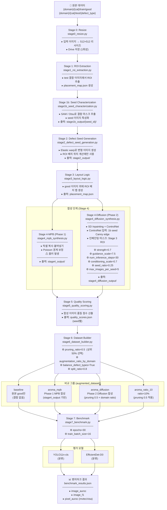

# AROMA Phase 2 파이프라인 흐름도

## 전체 흐름



---

## 성능 개선 지점 분석

### 합성 품질 (Stage 4)

| 파라미터 | 현재값 | 개선 방향 |
|---|---|---|
| `num_inference_steps` | 30 | 높일수록 품질↑, 속도↓ |
| `strength` | 0.7 | 낮추면 원본 보존↑, 높이면 변형↑ |
| `conditioning_scale` | 0.7 | 높이면 구조 보존↑ (아티팩트 위험) |
| `seed_ratio` | 0.25 | 낮음 → 합성 다양성 제한 |
| `max_images_per_seed` | 5 | 낮음 → 합성 풀 부족 |

### 합성 풀 크기 (Stage 4 → 5)

현재 pcb4 기준: **200개** (20 seed × 5장)  
pruning 후: **100개**  
→ `aroma_ratio_10` 이상 모든 비율이 100개 상한에 걸림

개선: `max_images_per_seed` 또는 `seed_ratio` 상향 → 풀 확대

### 품질 필터링 (Stage 5 → 6)

| 파라미터 | 현재값 | 비고 |
|---|---|---|
| `pruning_ratio` | 0.5 | 하위 50% 제거 |
| `augmentation_ratio` (visa/mvtec) | 2.0 | 원본의 2배 합성 사용 |

pruning_ratio 낮추면 더 엄격하게 필터 → 품질↑ 수량↓  
현재 합성 풀이 작아서 더 낮추면 데이터 부족 심화

### 비교 그룹 설계

```
baseline ──────────────────────────────────────────────▶ 기준선 (random ~0.5)
aroma_mpb ─────────────────────────────────────────────▶ Phase 1 성능
aroma_diffusion ────────────────────────────────────────▶ Phase 2 핵심 지표
aroma_ratio_10 ─────────────────────────────────────────▶ 비율 탐색 (현재 합성 풀 = 100개로 동일)
```

**핵심 비교**: `aroma_diffusion` vs `aroma_mpb` → Diffusion이 MPB 블러 문제를 해소하는지 검증

### ControlNet 입력 설계 (Stage 4)

현재: Stage 1b seed 원본 이미지 → Canny edge → ControlNet  
대안: Stage 3 placement_map의 마스크 윤곽 → ControlNet (구조 보존↑)  
대안2: Fine-tuned ControlNet 사용 (도메인 특화)

### 평가 모델 (Stage 7)

현재: YOLO11n-cls + EfficientDet-D0  
pixel_auroc 없음 (isp 도메인) → 분류 성능만 측정  
개선: segmentation 모델 추가로 결함 위치 정확도 측정
